# 第15章 自编码器

自编码器是能够在无监督的情况下学习输入数据（叫做编码）的人工神经网络（即，训练集是未标记）。这些编码通常具有比输入数据低得多的维度，使得自编码器对降维有用（参见第 8 章）。更重要的是，自编码器可以作为强大的特征检测器，它们可以用于无监督的深度神经网络预训练（正如我们在第 11 章中讨论过的）。最后，他们能够随机生成与训练数据非常相似的新数据；这被称为生成模型。例如，您可以在脸部图片上训练自编码器，然后可以生成新脸部。

令人惊讶的是，自编码器只需学习将输入复制到其输出即可工作。 这听起来像是一件小事，但我们会看到以各种方式约束网络可能会让它变得相当困难。例如，您可以限制内部表示的大小，或者可以向输入添加噪声并训练网络以恢复原始输入。这些约束防止自编码器将输入直接复制到输出，这迫使它学习表示数据的有效方法。 简言之，编码是自编码器在某些限制条件下尝试学习恒等函数的副产品。
在本章中，我们将更深入地解释自编码器如何工作，可以施加什么类型的约束以及如何使用 TensorFlow 实现它们，无论是降维，特征提取，无监督预训练还是生成模型。

## 有效的数据表示

您发现以下哪一个数字序列最容易记忆？

*   `40, 27, 25, 36, 81, 57, 10, 73, 19, 68`
*   `50, 25, 76, 38, 19, 58, 29, 88, 44, 22, 11, 34, 17, 52, 26, 13, 40, 20`

乍一看，第一个序列似乎应该更容易，因为它要短得多。 但是，如果仔细观察第二个序列，则可能会注意到它遵循两条简单规则：偶数是前面数的一半，奇数是前面数的三倍加一（这是一个着名的序列，称为雹石序列）。一旦你注意到这种模式，第二个序列比第一个更容易记忆，因为你只需要记住两个规则，第一个数字和序列的长度。 请注意，如果您可以快速轻松地记住非常长的序列，则您不会在意第二个序列中存在的模式。 你只需要了解每一个数字，就是这样。 事实上，很难记住长序列，因此识别模式非常有用，并且希望能够澄清为什么在训练过程中限制自编码器会促使它发现并利用数据中的模式。

记忆，感知和模式匹配之间的关系在 20 世纪 70 年代早期由 William Chase 和 Herbert Simon 着名研究。 他们观察到，专家棋手能够通过观看棋盘5秒钟来记忆所有棋子的位置，这是大多数人认为不可能完成的任务。 然而，只有当这些棋子被放置在现实位置（来自实际比赛）时才是这种情况，而不是随机放置棋子。 国际象棋专家没有比你更好的记忆，他们只是更容易看到国际象棋模式，这要归功于他们对比赛的经验。 注意模式有助于他们有效地存储信息。

就像这个记忆实验中的象棋棋手一样，一个自编码器会查看输入信息，将它们转换为高效的内部表示形式，然后吐出一些（希望）看起来非常接近输入的东西。 自编码器总是由两部分组成：将输入转换为内部表示的编码器（或识别网络），然后是将内部表示转换为输出的解码器（或生成网络）（见图 15-1）。

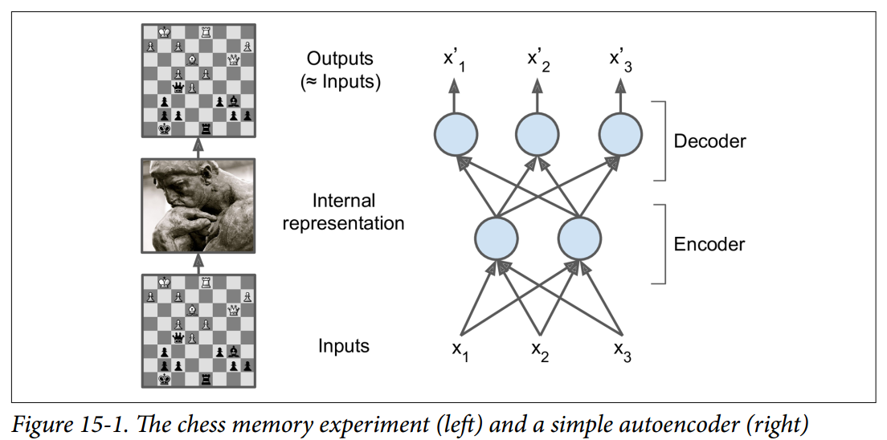

如您所见，自编码器通常具有与多层感知器（MLP，请参阅第 10 章）相同的体系结构，但输出层中的神经元数量必须等于输入数量。 在这个例子中，只有一个由两个神经元（编码器）组成的隐藏层和一个由三个神经元（解码器）组成的输出层。 由于自编码器试图重构输入，所以输出通常被称为重建，并且损失函数包含重建损失，当重建与输入不同时，重建损失会对模型进行惩罚。

由于内部表示具有比输入数据更低的维度（它是 2D 而不是 3D），所以自编码器被认为是不完整的。 不完整的自编码器不能简单地将其输入复制到编码，但它必须找到一种方法来输出其输入的副本。 它被迫学习输入数据中最重要的特征（并删除不重要的特征）。

我们来看看如何实现一个非常简单的不完整的自编码器，以降低维度。

## 用不完整的线性自编码器执行 PCA

如果自编码器仅使用线性激活并且损失函数是均方误差（MSE），则可以显示它最终执行主成分分析（参见第 8 章）。

以下代码构建了一个简单的线性自编码器，以在 3D 数据集上执行 PCA，并将其投影到 2D：

```py
import tensorflow as tf
from tensorflow.contrib.layers import fully_connected
n_inputs = 3 # 3D inputs
n_hidden = 2 # 2D codings
n_outputs = n_inputs
learning_rate = 0.01
X = tf.placeholder(tf.float32, shape=[None, n_inputs])
hidden = fully_connected(X, n_hidden, activation_fn=None)
outputs = fully_connected(hidden, n_outputs, activation_fn=None)
reconstruction_loss = tf.reduce_mean(tf.square(outputs - X)) # MSE
optimizer = tf.train.AdamOptimizer(learning_rate)
training_op = optimizer.minimize(reconstruction_loss)
init = tf.global_variables_initializer()
```

这段代码与我们在过去章节中建立的所有 MLP 没有什么不同。 需要注意的两件事是：

*   输出的数量等于输入的数量。
*   为了执行简单的 PCA，我们设置`activation_fn = None`（即，所有神经元都是线性的）

而损失函数是 MSE。 我们很快会看到更复杂的自编码器。

现在让我们加载数据集，在训练集上训练模型，并使用它来对测试集进行编码（即将其投影到 2D）：

```py
X_train, X_test = [...] # load the dataset
n_iterations = 1000
codings = hidden # the output of the hidden layer provides the codings
with tf.Session() as sess:
    init.run()
    for iteration in range(n_iterations):
        training_op.run(feed_dict={X: X_train}) # no labels (unsupervised)
    codings_val = codings.eval(feed_dict={X: X_test})
```

图 15-2 显示了原始 3D 数据集（左侧）和自编码器隐藏层的输出（即编码层，右侧）。 正如您所看到的，自编码器找到了将数据投影到数据上的最佳二维平面，保留了数据的尽可能多的差异（就像 PCA 一样）。

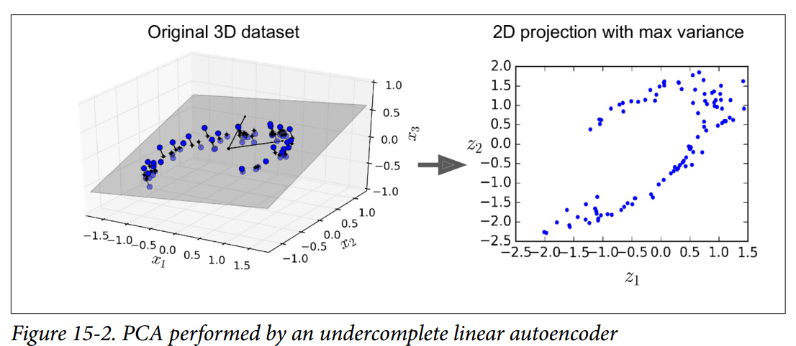

## 栈式自编码器（SAE）

就像我们讨论过的其他神经网络一样，自编码器可以有多个隐藏层。 在这种情况下，它们被称为栈式自编码器（或深度自编码器）。 添加更多层有助于自编码器了解更复杂的编码。 但是，必须注意不要让自编码器功能太强大。 设想一个编码器非常强大，只需学习将每个输入映射到一个任意数字（并且解码器学习反向映射）即可。 很明显，这样的自编码器将完美地重构训练数据，但它不会在过程中学习到任何有用的数据表示（并且它不可能很好地推广到新的实例）。

栈式自编码器的架构关于中央隐藏层（编码层）通常是对称的。 简单来说，它看起来像一个三明治。 例如，一个用于 MNIST 的自编码器（在第 3 章中介绍）可能有 784 个输入，其次是一个隐藏层，有 300 个神经元，然后是一个中央隐藏层，有 150 个神经元，然后是另一个隐藏层，有 300 个神经元，输出层有 784 神经元。 这个栈式自编码器如图 15-3 所示。

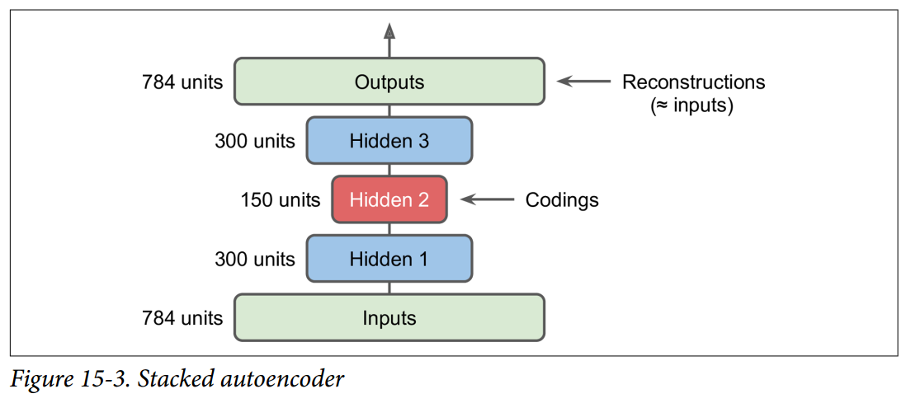

## TensorFlow实现

您可以像常规深度 MLP 一样实现栈式自编码器。 特别是，我们在第 11 章中用于训练深度网络的技术也可以应用。例如，下面的代码使用 He 初始化，ELU 激活函数和 l2 正则化为 MNIST 构建一个栈式自编码器。 代码应该看起来很熟悉，除了没有标签（没有`y`）：

```py
n_inputs = 28 * 28 # for MNIST
n_hidden1 = 300
n_hidden2 = 150 # codings
n_hidden3 = n_hidden1
n_outputs = n_inputs

learning_rate = 0.01
l2_reg = 0.001

X = tf.placeholder(tf.float32, shape=[None, n_inputs])
with tf.contrib.framework.arg_scope(
        [fully_connected],
        activation_fn=tf.nn.elu,
        weights_initializer=tf.contrib.layers.variance_scaling_initializer(),
        weights_regularizer=tf.contrib.layers.l2_regularizer(l2_reg)):
    hidden1 = fully_connected(X, n_hidden1)
    hidden2 = fully_connected(hidden1, n_hidden2) # codings
    hidden3 = fully_connected(hidden2, n_hidden3)
    outputs = fully_connected(hidden3, n_outputs, activation_fn=None)
reconstruction_loss = tf.reduce_mean(tf.square(outputs - X)) # MSE

reg_losses = tf.get_collection(tf.GraphKeys.REGULARIZATION_LOSSES)
loss = tf.add_n([reconstruction_loss] + reg_losses)

optimizer = tf.train.AdamOptimizer(learning_rate)
training_op = optimizer.minimize(loss)

init = tf.global_variables_initializer()
```

然后可以正常训练模型。 请注意，数字标签（`y_batch`）未使用：

```py
n_epochs = 5
batch_size = 150
with tf.Session() as sess:
    init.run()
    for epoch in range(n_epochs):
        n_batches = mnist.train.num_examples // batch_size
        for iteration in range(n_batches):
            X_batch, y_batch = mnist.train.next_batch(batch_size)
            sess.run(training_op, feed_dict={X: X_batch})
```

## 关联权重

当自编码器整齐地对称时，就像我们刚刚构建的那样，一种常用技术是将解码器层的权重与编码器层的权重相关联。 这样减少了模型中的权重数量，加快了训练速度，并限制了过度拟合的风险。
具体来说，如果自编码器总共具有`N`个层（不计入输入层），并且 $W_[L]$ 表示第`L`层的连接权重（例如，层1是第一隐藏层，则层`N / 2`是编码 层，而层`N`是输出层），则解码器层权重可以简单地定义为： $W_[N-L + 1]= W_[L]T$ （其中`L = 1,2，...，N2`）。
不幸的是，使用`fully_connected()`函数在 TensorFlow 中实现相关权重有点麻烦；手动定义层实际上更容易。 代码结尾明显更加冗长：

```py
activation = tf.nn.elu
regularizer = tf.contrib.layers.l2_regularizer(l2_reg)
initializer = tf.contrib.layers.variance_scaling_initializer()

X = tf.placeholder(tf.float32, shape=[None, n_inputs])

weights1_init = initializer([n_inputs, n_hidden1])
weights2_init = initializer([n_hidden1, n_hidden2])

weights1 = tf.Variable(weights1_init, dtype=tf.float32, name="weights1")
weights2 = tf.Variable(weights2_init, dtype=tf.float32, name="weights2")
weights3 = tf.transpose(weights2, name="weights3") # tied weights
weights4 = tf.transpose(weights1, name="weights4") # tied weights

biases1 = tf.Variable(tf.zeros(n_hidden1), name="biases1")
biases2 = tf.Variable(tf.zeros(n_hidden2), name="biases2")
biases3 = tf.Variable(tf.zeros(n_hidden3), name="biases3")
biases4 = tf.Variable(tf.zeros(n_outputs), name="biases4")

hidden1 = activation(tf.matmul(X, weights1) + biases1)
hidden2 = activation(tf.matmul(hidden1, weights2) + biases2)
hidden3 = activation(tf.matmul(hidden2, weights3) + biases3)
outputs = tf.matmul(hidden3, weights4) + biases4

reconstruction_loss = tf.reduce_mean(tf.square(outputs - X))
reg_loss = regularizer(weights1) + regularizer(weights2)
loss = reconstruction_loss + reg_loss

optimizer = tf.train.AdamOptimizer(learning_rate)
training_op = optimizer.minimize(loss)

init = tf.global_variables_initializer()
```

这段代码非常简单，但有几件重要的事情需要注意：

*   首先，权重 3 和权重 4 不是变量，它们分别是权重 2 和权重 1 的转置（它们与它们“绑定”）。
*   其次，由于它们不是变量，所以规范它们是没有用的：我们只调整权重 1 和权重 2。
*   第三，偏置永远不会被束缚，并且永远不会正规化。

## 一次训练一个自编码器

我们不是一次完成整个栈式自编码器的训练，而是一次训练一个浅自编码器，然后将所有这些自编码器堆叠到一个栈式自编码器（因此名称）中，通常要快得多，如图 15-4 所示。 这对于非常深的自编码器特别有用。

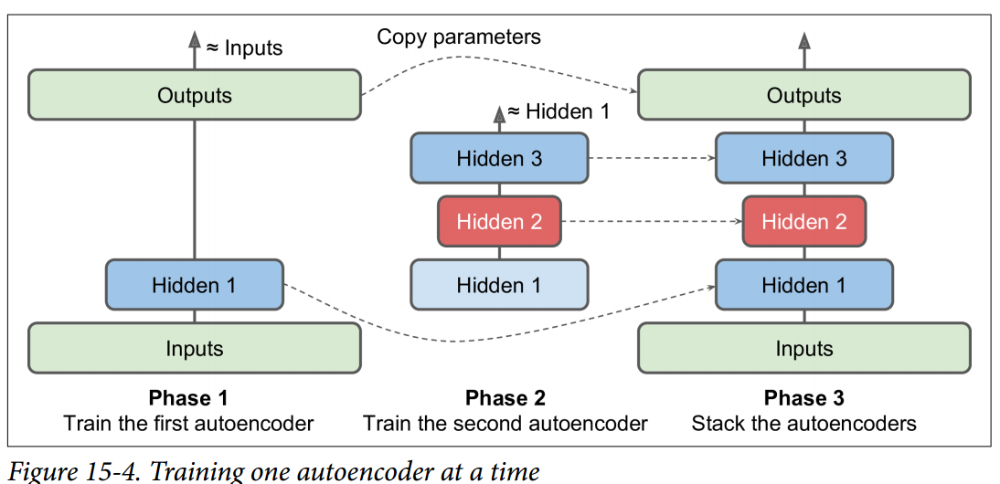

在训练的第一阶段，第一个自编码器学习重构输入。 在第二阶段，第二个自编码器学习重构第一个自编码器隐藏层的输出。 最后，您只需使用所有这些自编码器来构建一个大三明治，如图 15-4 所示（即，您首先将每个自编码器的隐藏层，然后按相反顺序堆叠输出层）。 这给你最后的栈式自编码器。 您可以用这种方式轻松地训练更多的自编码器，构建一个非常深的栈式自编码器。

为了实现这种多阶段训练算法，最简单的方法是对每个阶段使用不同的 TensorFlow 图。 训练完一个自编码器后，您只需通过它运行训练集并捕获隐藏层的输出。 这个输出作为下一个自编码器的训练集。 一旦所有自编码器都以这种方式进行了训练,您只需复制每个自编码器的权重和偏置，然后使用它们来构建堆叠的自编码器。 实现这种方法非常简单，所以我们不在这里详细说明，但请查阅 Jupyter notebooks 中的代码作为示例。

另一种方法是使用包含整个栈式自编码器的单个图，以及执行每个训练阶段的一些额外操作，如图 15-5 所示。

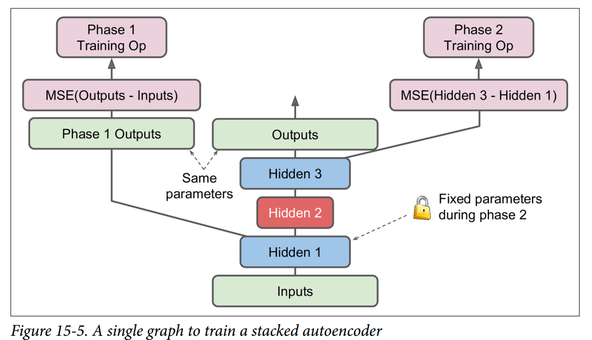

这值得解释一下：

*   图中的中央列是完整的栈式自编码器。这部分可以在训练后使用。

*   左列是运行第一阶段训练所需的一系列操作。它创建一个绕过隐藏层 2 和 3 的输出层。该输出层与堆叠的自编码器的输出层共享相同的权重和偏置。此外还有旨在使输出尽可能接近输入的训练操作。因此，该阶段将训练隐藏层1和输出层（即，第一自编码器）的权重和偏置。

*   图中的右列是运行第二阶段训练所需的一组操作。它增加了训练操作，目的是使隐藏层 3 的输出尽可能接近隐藏层 1 的输出。注意，我们必须在运行阶段 2 时冻结隐藏层 1。此阶段将训练隐藏层 1 的权重和偏置给隐藏的层 2 和 3（即第二自 编码器）。

TensorFlow 代码如下所示：

```py
[...] # Build the whole stacked autoencoder normally.
# In this example, the weights are not tied.
optimizer = tf.train.AdamOptimizer(learning_rate)

with tf.name_scope("phase1"):
    phase1_outputs = tf.matmul(hidden1, weights4) + biases4
    phase1_reconstruction_loss = tf.reduce_mean(tf.square(phase1_outputs - X))
    phase1_reg_loss = regularizer(weights1) + regularizer(weights4)
    phase1_loss = phase1_reconstruction_loss + phase1_reg_loss
    phase1_training_op = optimizer.minimize(phase1_loss)

with tf.name_scope("phase2"):
    phase2_reconstruction_loss = tf.reduce_mean(tf.square(hidden3 - hidden1))
    phase2_reg_loss = regularizer(weights2) + regularizer(weights3)
    phase2_loss = phase2_reconstruction_loss + phase2_reg_loss
    train_vars = [weights2, biases2, weights3, biases3]
    phase2_training_op = optimizer.minimize(phase2_loss, var_list=train_vars)    
```

第一阶段比较简单：我们只创建一个跳过隐藏层 2 和 3 的输出层，然后构建训练操作以最小化输出和输入之间的距离（加上一些正则化）。

第二阶段只是增加了将隐藏层 3 和隐藏层 1 的输出之间的距离最小化的操作（还有一些正则化）。 最重要的是，我们向`minim()`方法提供可训练变量的列表，确保省略权重 1 和偏差 1；这有效地冻结了阶段 2 期间的隐藏层 1。

在执行阶段，你需要做的就是为阶段 1 一些迭代进行训练操作，然后阶段 2 训练运行更多的迭代。

由于隐藏层 1 在阶段 2 期间被冻结，所以对于任何给定的训练实例其输出将总是相同的。 为了避免在每个时期重新计算隐藏层1的输出，您可以在阶段 1 结束时为整个训练集计算它，然后直接在阶段 2 中输入隐藏层 1 的缓存输出。这可以得到一个不错的性能上的提升。

## 可视化重建

确保自编码器得到适当训练的一种方法是比较输入和输出。 它们必须非常相似，差异应该是不重要的细节。 我们来绘制两个随机数字及其重建：

```py
n_test_digits = 2
X_test = mnist.test.images[:n_test_digits]

with tf.Session() as sess:
    [...] # Train the Autoencoder
    outputs_val = outputs.eval(feed_dict={X: X_test})

def plot_image(image, shape=[28, 28]):
    plt.imshow(image.reshape(shape), cmap="Greys", interpolation="nearest")
    plt.axis("off")

for digit_index in range(n_test_digits):
    plt.subplot(n_test_digits, 2, digit_index * 2 + 1)
    plot_image(X_test[digit_index])
    plt.subplot(n_test_digits, 2, digit_index * 2 + 2)
    plot_image(outputs_val[digit_index])
```
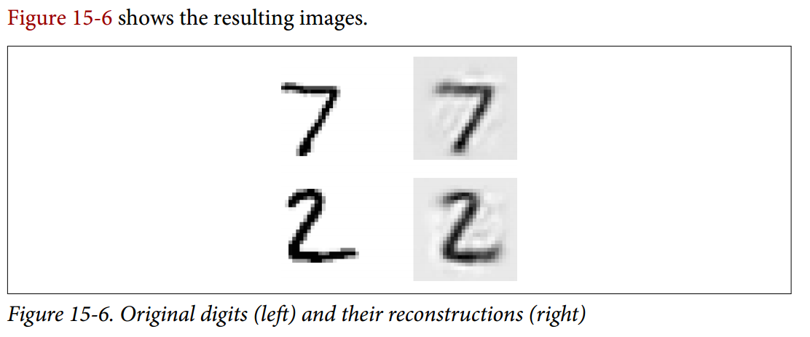

看起来够接近。 所以自编码器已经适当地学会了重现它，但是它学到了有用的特性？ 让我们来看看。

## 可视化功能

一旦你的自编码器学习了一些功能，你可能想看看它们。 有各种各样的技术。 可以说最简单的技术是在每个隐藏层中考虑每个神经元，并找到最能激活它的训练实例。 这对顶层隐藏层特别有用，因为它们通常会捕获相对较大的功能，您可以在包含它们的一组训练实例中轻松找到这些功能。 例如，如果神经元在图片中看到一只猫时强烈激活，那么激活它的图片最显眼的地方都会包含猫。 然而，对于较低层，这种技术并不能很好地工作，因为这些特征更小，更抽象，因此很难准确理解神经元正在为什么而兴奋。

让我们看看另一种技术。 对于第一个隐藏层中的每个神经元，您可以创建一个图像，其中像素的强度对应于给定神经元的连接权重。 例如，以下代码绘制了第一个隐藏层中五个神经元学习的特征：

```py
with tf.Session() as sess:
    [...] # train autoencoder
    weights1_val = weights1.eval()

for i in range(5):
    plt.subplot(1, 5, i + 1)
    plot_image(weights1_val.T[i])
```

您可能会得到如图 15-7 所示的低级功能。


前四个特征似乎对应于小块，而第五个特征似乎寻找垂直笔划（请注意，这些特征来自堆叠去噪自编码器，我们将在后面讨论）。

另一种技术是给自编码器提供一个随机输入图像，测量您感兴趣的神经元的激活，然后执行反向传播来调整图像，使神经元激活得更多。 如果迭代数次（执行渐变上升），图像将逐渐变成最令人兴奋的图像（用于神经元）。 这是一种有用的技术，用于可视化神经元正在寻找的输入类型。

最后，如果使用自编码器执行无监督预训练（例如，对于分类任务），验证自编码器学习的特征是否有用的一种简单方法是测量分类器的性能。

## 无监督预训练使用栈式自编码器

正如我们在第 11 章中讨论的那样，如果您正在处理复杂的监督任务，但您没有大量标记的训练数据，则一种解决方案是找到执行类似任务的神经网络，然后重新使用其较低层。 这样就可以仅使用很少的训练数据来训练高性能模型，因为您的神经网络不必学习所有的低级特征；它将重新使用现有网络学习的特征检测器。

同样，如果您有一个大型数据集，但大多数数据集未标记，您可以先使用所有数据训练栈式自编码器，然后重新使用较低层为实际任务创建一个神经网络，并使用标记数据对其进行训练。 例如，图 15-8 显示了如何使用栈式自编码器为分类神经网络执行无监督预训练。 正如前面讨论过的，栈式自编码器本身通常每次都会训练一个自编码器。 在训练分类器时，如果您确实没有太多标记的训练数据，则可能需要冻结预训练层（至少是较低层）。

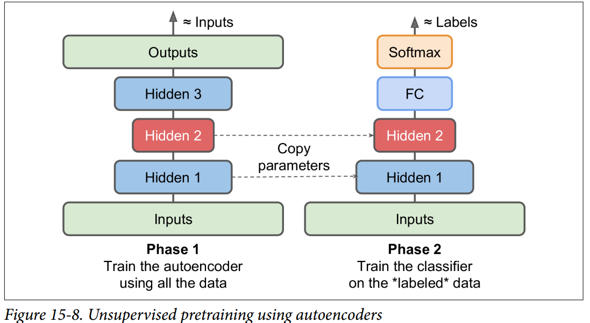

这种情况实际上很常见，因为构建一个大型的无标签数据集通常很便宜（例如，一个简单的脚本可以从互联网上下载数百万张图像），但只能由人类可靠地标记它们（例如，将图像分类为可爱或不可爱）。 标记实例是耗时且昂贵的，因此只有几千个标记实例是很常见的。

正如我们前面所讨论的那样，当前深度学习海啸的触发因素之一是 Geoffrey Hinton 等人在 2006 年的发现，深度神经网络可以以无监督的方式进行预训练。 他们使用受限玻尔兹曼机器（见附录 E），但在 2007 年 Yoshua Bengio 等人表明自编码器也起作用。

TensorFlow 的实现没有什么特别之处：只需使用所有训练数据训练自编码器，然后重用其编码器层以创建一个新的神经网络（有关如何重用预训练层的更多详细信息，请参阅第 11 章或查看 Jupyte notebooks 中的代码示例）。

到目前为止，为了强制自编码器学习有趣的特性，我们限制了编码层的大小，使其不够完善。 实际上可以使用许多其他类型的约束，包括允许编码层与输入一样大或甚至更大的约束，导致过度完成的自编码器。 现在我们来看看其中的一些方法。

## 降噪自编码（DAE）

另一种强制自编码器学习有用功能的方法是为其输入添加噪声，对其进行训练以恢复原始的无噪声输入。 这可以防止自编码器将其输入复制到其输出，因此最终不得不在数据中查找模式。

自 20 世纪 80 年代以来，使用自编码器消除噪音的想法已经出现（例如，在 Yann LeCun 的 1987 年硕士论文中提到过）。 在 2008 年的一篇论文中，帕斯卡尔文森特等人。 表明自编码器也可用于特征提取。 在 2010 年的一篇文章中 Vincent 等人引入堆叠降噪自编码器。

噪声可以是纯粹的高斯噪声添加到输入，或者它可以随机关闭输入，就像 drop out（在第 11 章介绍）。 图 15-9 显示了这两个选项。

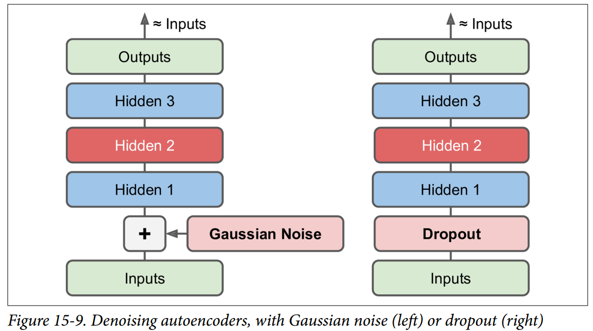

## TensorFlow 实现

在 TensorFlow 中实现去噪自编码器并不难。 我们从高斯噪声开始。 这实际上就像训练一个常规的自编码器一样，除了给输入添加噪声外，重建损耗是根据原始输入计算的：

```py
X = tf.placeholder(tf.float32, shape=[None, n_inputs])
X_noisy = X + tf.random_normal(tf.shape(X))
[...]
hidden1 = activation(tf.matmul(X_noisy, weights1) + biases1)
[...]
reconstruction_loss = tf.reduce_mean(tf.square(outputs - X)) # MSE
[...]
```

由于`X`的形状只是在构造阶段部分定义的，我们不能预先知道我们必须添加到`X`中的噪声的形状。我们不能调用`X.get_shape()`，因为这只会返回部分定义的`X`的形状 （`[None，n_inputs]`）和`random_normal()`需要一个完全定义的形状，因此会引发异常。 相反，我们调用`tf.shape(X)`，它将创建一个操作，该操作将在运行时返回`X`的形状，该操作将在此时完全定义。

实施更普遍的 dropout 版本,而且这个版本并不困难：

```py
from tensorflow.contrib.layers import dropout

keep_prob = 0.7

is_training = tf.placeholder_with_default(False, shape=(), name='is_training')
X = tf.placeholder(tf.float32, shape=[None, n_inputs])
X_drop = dropout(X, keep_prob, is_training=is_training)
[...]
hidden1 = activation(tf.matmul(X_drop, weights1) + biases1)
[...]
reconstruction_loss = tf.reduce_mean(tf.square(outputs - X)) # MSE
[...]
```

在训练期间，我们必须使用`feed_dict`将`is_training`设置为`True`（如第 11 章所述）：

```py
sess.run(training_op, feed_dict={X: X_batch, is_training: True})
```

但是，在测试期间，不需要将`is_training`设置为`False`，因为我们将其设置为对`placeholder_with_default()`函数调用的默认值。

## 稀疏自编码器

通常良好特征提取的另一种约束是稀疏性：通过向损失函数添加适当的项，自编码器被推动以减少编码层中活动神经元的数量。 例如，它可能被推到编码层中平均只有 5% 的显着活跃的神经元。 这迫使自编码器将每个输入表示为少量激活的组合。 因此，编码层中的每个神经元通常都会代表一个有用的特征（如果您每个月只能说几个字，您可能会试着让它们值得一听）。

为了支持稀疏模型，我们必须首先在每次训练迭代中测量编码层的实际稀疏度。 我们通过计算整个训练批次中编码层中每个神经元的平均激活来实现。 批量大小不能太小，否则平均数不准确。

一旦我们对每个神经元进行平均激活，我们希望通过向损失函数添加稀疏损失来惩罚太活跃的神经元。 例如，如果我们测量一个神经元的平均激活值为 0.3，但目标稀疏度为 0.1，那么它必须受到惩罚才能激活更少。 一种方法可以简单地将平方误差`(0.3-0.1)^2`添加到损失函数中，但实际上更好的方法是使用 Kullback-Leibler 散度（在第 4 章中简要讨论），其具有比平均值更强的梯度 平方误差，如图 15-10 所示。

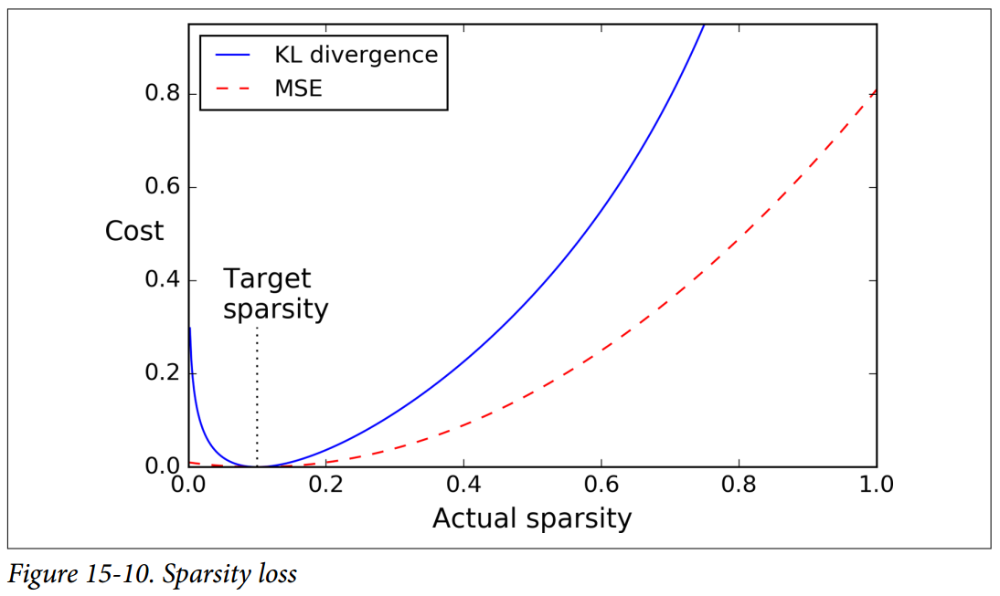

给定两个离散的概率分布`P`和`Q`，这些分布之间的 KL 散度，记为`Dkl(P || Q)`，可以使用公式 15-1 计算。


在我们的例子中，我们想要测量编码层中的神经元将激活的目标概率`p`与实际概率`q`（即，训练批次上的平均激活）之间的差异。 所以KL散度简化为公式 15-2。


一旦我们已经计算了编码层中每个神经元的稀疏损失，我们就总结这些损失，并将结果添加到损失函数中。 为了控制稀疏损失和重构损失的相对重要性，我们可以用稀疏权重超参数乘以稀疏损失。 如果这个权重太高，模型会紧贴目标稀疏度，但它可能无法正确重建输入，导致模型无用。 相反，如果它太低，模型将大多忽略稀疏目标，它不会学习任何有趣的功能。

## TensorFlow 实现

我们现在拥有了使用 TensorFlow 实现稀疏自编码器所需的全部功能：

```py
def kl_divergence(p, q):
    return p * tf.log(p / q) + (1 - p) * tf.log((1 - p) / (1 - q))

learning_rate = 0.01
sparsity_target = 0.1
sparsity_weight = 0.2

[...] # Build a normal autoencoder (in this example the coding layer is hidden1)

optimizer = tf.train.AdamOptimizer(learning_rate)

hidden1_mean = tf.reduce_mean(hidden1, axis=0) # batch mean
sparsity_loss = tf.reduce_sum(kl_divergence(sparsity_target, hidden1_mean))
reconstruction_loss = tf.reduce_mean(tf.square(outputs - X)) # MSE
loss = reconstruction_loss + sparsity_weight * sparsity_loss
training_op = optimizer.minimize(loss)
```

一个重要的细节是编码层的激活必须介于 0 和 1 之间（但不等于 0 或 1），否则 KL 散度将返回`NaN`（非数字）。 一个简单的解决方案是对编码层使用逻辑激活功能：

```py
hidden1 = tf.nn.sigmoid(tf.matmul(X, weights1) + biases1)
```

一个简单的技巧可以加速收敛：不是使用 MSE，我们可以选择一个具有较大梯度的重建损失。 交叉熵通常是一个不错的选择。 要使用它，我们必须对输入进行规范化处理，使它们的取值范围为 0 到 1，并在输出层中使用逻辑激活函数，以便输出也取值为 0 到 1。TensorFlow 的`sigmoid_cross_entropy_with_logits()`函数负责 有效地将 logistic（sigmoid）激活函数应用于输出并计算交叉熵：

```py
[...]
logits = tf.matmul(hidden1, weights2) + biases2)
    outputs = tf.nn.sigmoid(logits)

reconstruction_loss = tf.reduce_sum(
    tf.nn.sigmoid_cross_entropy_with_logits(labels=X, logits=logits))
```

请注意，训练期间不需要输出操作（我们仅在我们想要查看重建时才使用它）。

## 变分自编码器（VAE）

Diederik Kingma 和 Max Welling 于 2014 年推出了另一类重要的自编码器，并迅速成为最受欢迎的自编码器类型之一：变分自编码器。

它们与我们迄今为止讨论的所有自编码器完全不同，特别是：

*   它们是概率自编码器，意味着即使在训练之后，它们的输出部分也是偶然确定的（相对于仅在训练过程中使用随机性的自编码器的去噪）。
*   最重要的是，它们是生成自编码器，这意味着它们可以生成看起来像从训练集中采样的新实例。

这两个属性使它们与 RBM 非常相似（见附录 E），但它们更容易训练，并且取样过程更快（在 RBM 之前，您需要等待网络稳定在“热平衡”之后才能进行取样一个新的实例）

我们来看看他们是如何工作的。 图 15-11（左）显示了一个变分自编码器。 当然，您可以认识到所有自编码器的基本结构，编码器后跟解码器（在本例中，它们都有两个隐藏层），但有一个转折点：不是直接为给定的输入生成编码 ，编码器产生平均编码`μ`和标准差`σ`。 然后从平均值`μ`和标准差`σ`的高斯分布随机采样实际编码。 之后，解码器正常解码采样的编码。 该图的右侧部分显示了一个训练实例通过此自编码器。 首先，编码器产生`μ`和`σ`，随后对编码进行随机采样（注意它不是完全位于`μ`处），最后对编码进行解码，最终的输出与训练实例类似。

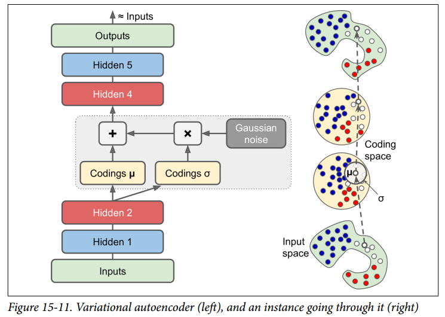

从图中可以看出，尽管输入可能具有非常复杂的分布，但变分自编码器倾向于产生编码，看起来好像它们是从简单的高斯分布采样的：在训练期间，损失函数（将在下面讨论）推动 编码在编码空间（也称为潜在空间）内逐渐迁移以占据看起来像高斯点集成的云的大致（超）球形区域。 一个重要的结果是，在训练了一个变分自编码器之后，你可以很容易地生成一个新的实例：只需从高斯分布中抽取一个随机编码，对它进行解码就可以了！

那么让我们看看损失函数。 它由两部分组成。 首先是通常的重建损失，推动自编码器重现其输入（我们可以使用交叉熵来解决这个问题，如前所述）。 第二种是潜在的损失，推动自编码器使编码看起来像是从简单的高斯分布中采样，为此我们使用目标分布（高斯分布）与编码实际分布之间的 KL 散度。 数学比以前复杂一点，特别是因为高斯噪声，它限制了可以传输到编码层的信息量（从而推动自编码器学习有用的特征）。 幸运的是，这些方程简化为下面的潜在损失代码：

```py
eps = 1e-10 # smoothing term to avoid computing log(0) which is NaN
latent_loss = 0.5 * tf.reduce_sum(
    tf.square(hidden3_sigma) + tf.square(hidden3_mean)
    - 1 - tf.log(eps + tf.square(hidden3_sigma)))
```

一种常见的变体是训练编码器输出`γ= log(σ^2)`而不是`σ`。 只要我们需要`σ`，我们就可以计算`σ= exp(2/γ)`。 这使得编码器可以更轻松地捕获不同比例的`σ`，从而有助于加快收敛速度。 潜在损失结束会变得更简单一些：

```py
latent_loss = 0.5 * tf.reduce_sum(
    tf.exp(hidden3_gamma) + tf.square(hidden3_mean) - 1 - hidden3_gamma)
```

以下代码使用`log(σ^2)`变体构建图 15-11（左）所示的变分自编码器:

```py
n_inputs = 28 * 28 # for MNIST
n_hidden1 = 500
n_hidden2 = 500
n_hidden3 = 20 # codings
n_hidden4 = n_hidden2
n_hidden5 = n_hidden1
n_outputs = n_inputs

learning_rate = 0.001

with tf.contrib.framework.arg_scope(    
        [fully_connected],
        activation_fn=tf.nn.elu,
        weights_initializer=tf.contrib.layers.variance_scaling_initializer()):
    X = tf.placeholder(tf.float32, [None, n_inputs])
    hidden1 = fully_connected(X, n_hidden1)
    hidden2 = fully_connected(hidden1, n_hidden2)
    hidden3_mean = fully_connected(hidden2, n_hidden3, activation_fn=None)
    hidden3_gamma = fully_connected(hidden2, n_hidden3, activation_fn=None)
    hidden3_sigma = tf.exp(0.5 * hidden3_gamma)
    noise = tf.random_normal(tf.shape(hidden3_sigma), dtype=tf.float32)
    hidden3 = hidden3_mean + hidden3_sigma * noise
    hidden4 = fully_connected(hidden3, n_hidden4)
    hidden5 = fully_connected(hidden4, n_hidden5)
    logits = fully_connected(hidden5, n_outputs, activation_fn=None)
    outputs = tf.sigmoid(logits)
reconstruction_loss = tf.reduce_sum(
    tf.nn.sigmoid_cross_entropy_with_logits(labels=X, logits=logits))
latent_loss = 0.5 * tf.reduce_sum(
    tf.exp(hidden3_gamma) + tf.square(hidden3_mean) - 1 - hidden3_gamma)
cost = reconstruction_loss + latent_loss

optimizer = tf.train.AdamOptimizer(learning_rate=learning_rate)
training_op = optimizer.minimize(cost)

init = tf.global_variables_initializer()
```

## 生成数字

现在让我们使用这个变分自编码器来生成看起来像手写数字的图像。 我们所需要做的就是训练模型，然后从高斯分布中对随机编码进行采样并对它们进行解码。

```py
import numpy as np
n_digits = 60
n_epochs = 50
batch_size = 150
with tf.Session() as sess:
    init.run()
    for epoch in range(n_epochs):
        n_batches = mnist.train.num_examples // batch_size
        for iteration in range(n_batches):
            X_batch, y_batch = mnist.train.next_batch(batch_size)
            sess.run(training_op, feed_dict={X: X_batch})

    codings_rnd = np.random.normal(size=[n_digits, n_hidden3])
    outputs_val = outputs.eval(feed_dict={hidden3: codings_rnd})
```

现在我们可以看到由autoencoder生成的“手写”数字是什么样的（参见图15-12）：

```py
for iteration in range(n_digits):
    plt.subplot(n_digits, 10, iteration + 1)
    plot_image(outputs_val[iteration])
```

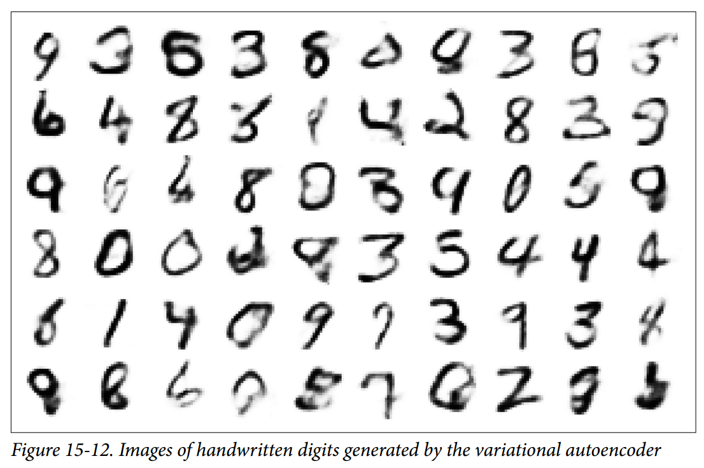

## 其他自编码器

监督式学习在图像识别，语音识别，文本翻译等方面取得的惊人成就在某种程度上掩盖了无监督学习的局面，但它实际上正在蓬勃发展。 自编码器和其他无监督学习算法的新体系结构定期发明，以至于我们无法在本书中全面介绍它们。 以下是您可能想要查看的几种类型的自编码器的简要说明（绝非详尽无遗）：

压缩自编码器（CAE）

自编码器在训练过程中受到约束，因此与输入有关的编码的导数很小。 换句话说，两个类似的输入必须具有相似的编码。

栈式卷积自编码器（SCAE）

学习通过重构通过卷积层处理的图像来提取视觉特征的自编码器。

生成随机网络（GSN）

消除自编码器的泛化，增加了生成数据的能力。

赢家通吃（WTA）的自编码

在训练期间，在计算编码层中所有神经元的激活之后，只保留训练批次上每个神经元的前 k% 激活，其余部分设为零。 自然这导致稀疏的编码。 而且，可以使用类似的 WTA 方法来产生稀疏卷积自编码器。

对抗自编码器（AAE）

一个网络被训练来重现它的输入，同时另一个网络被训练去找到第一个网络不能正确重建的输入。 这推动了第一个自编码器学习健壮的编码。

