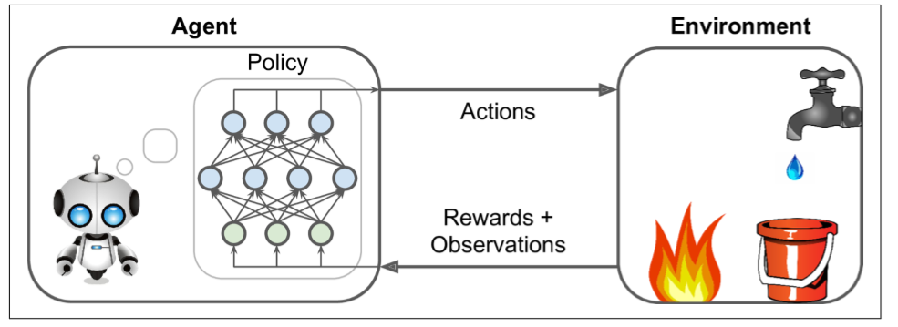

# 第16章 强化学习

强化学习(RL)如今是机器学习的一大令人激动的领域，当然之前也是。自从1950年被发明出来后，它在这些年产生了一些有趣的应用，尤其是在游戏(例如TD-Gammon，一个西洋双陆棋程序)和及其控制领域。，但是从未弄出什么大新闻。直到2013年一个革命性的发展：来自英国的研究者发起了一项Deepmind项目，这个项目可以学习去玩任何从头开始的Atari游戏，甚至多数比人类玩的还要好，它仅适用像素作为输入并且没有游戏规则的任何先验知识。这是一系列令人惊叹的壮举，在2016年3月以他们的系统阿尔法狗战胜了世界围棋冠军李世石。没有一个程序能接近这个游戏的主宰，更不用说世界冠军了。今天，RL的整个领域正在沸腾着新的想法，其都具有广泛的应用范围。DeepMind在2014被谷歌以超过5亿美元收购。

那么他们是怎么做到的呢？事后看来，原理似乎相当简单：他们将深度学习运用到强化学习领域，结果却超越了他们最疯狂的设想。在本章中，我们将首先解释强化学习是什么，以及它擅长于什么，然后我们将介绍两个在深度强化学习领域最重要的技术：策略梯度和深度Q网络（DQN），包括讨论马尔可夫决策过程（MDP）。我们将使用这些技术来训练一个模型来平衡移动车上的杆子，另一个玩Atari游戏。同样的技术可以用于各种各样的任务，从步行机器人到自动驾驶汽车。

## 学习优化奖励

在强化学习中，一个点在环境中观察并且做出决策，随后它会得到奖励。它的目标是去学习如何行动能最大化期望的奖励。如果你不在意去拟人化的话，你可以认为正奖励是愉快，负奖励是痛苦（这样的话奖励一词就有点误导了）。简单来说，这个点在环境中行动，并且在实验和错误中去学习最大化它的愉快，最小化它的痛苦。

这是一个相当广泛的设置，可以适用于各种各样的任务。以下是几个例子（详见图16-1）：

a.这个点可以是控制一个机械狗的程序。在此例中，环境就是真实的世界，这个点通过许多的传感器例如摄像机或者传感器来观察，它可以通过给电机驱动信号来行动。它可以被编程设置为如果到达了目的地就得到正奖励，如果浪费时间，或者走错方向，或摔倒了就得到负奖励。
b.这个点可以是控制MS.Pac-Man的程序。在此例中，环境是Atari游戏的仿真，行为是9个操纵杆位（上下左右中间等等），观察是屏幕，回报就是游戏点数。
c.相似地，这个点也可以是棋盘游戏的程序例如：GO游戏。
d.这个点也可以不用去控制一个实体（或虚拟的）去移动。例如它可以是一个智能程序，当它调整到目标温度以节能时会得到正奖励，当人们需要自己去调节温度时它会得到负奖励，所以这个点必须学会预见人们的需要。
e.这个点也可以去观测股票市场价格以实时决定买卖。奖励的依据显然为挣钱或者赔钱。


其实没有正奖励也是可以的，例如一个点在迷宫内移动，它每分每秒都得到一个负奖励，所以它要尽可能快的找到出口！还有很多适合强化学习的领域，例如自动驾驶汽车，在网页上放广告，或者控制一个图像分类系统让它明白它应该关注于什么。

## 策略搜索

被这个点使用去觉得它行为的算法叫做策略。例如，策略可以是一个把观测当输入，行为当做输出的神经网络。



这个策略可以是你能想到的任何算法，它甚至可以不被确定。举个例子，例如，考虑一个真空吸尘器，它的奖励是在30分钟内捡起的灰尘数量。它的策略可以是每秒以概率P向前移动，或者以概率1-P随机地向左或向右旋转。旋转角度将是-R和+R之间的随机角度，因为该策略涉及一些随机性，所以称为随机策略。机器人将有一个不稳定的轨迹，它保证它最终会到达任何可以到达的地方，并捡起所有的灰尘。问题是：30分钟后它会捡起多少灰尘？

你怎么训练这样的机器人？你可以调整两个策略参数：概率P和角度范围R。一个想法是这些参数尝试许多不同的值，并选择执行最佳的组合（见图16-3）。这是一个策略搜索的例子，在这种情况下使用野蛮的方法。然而，当策略空间太大（通常情况下），以这样的方式找到一组好的参数就像在一个巨大的草堆中寻找一根针。

另一种搜寻策略空间的方法是遗传算法。例如你可以随机创造一个包含100个策略的第一代基因，随后杀死80个坏策略，随后让20个幸存策略繁衍4代。一个后代只是它父辈基因的复制品加上一些随机变异。幸存的策略加上他们的后代共同构成了第二代。你可以继续以这种方式迭代代，直到找到一个好的策略。


另一种方法是使用优化技术，通过评估关于策略参数的奖励的梯度，然后通过跟随梯度向更高的奖励（梯度上升）调整这些参数。这种方法被称为策略梯度（PG），我们将在本章后面详细讨论。例如，回到真空吸尘器机器人，你可以稍微增加P并评估这是否增加了机器人在30分钟内拾起的灰尘的量；如果它相对应增加P，或者减少P。我们将使用Tensorflow来实现PG算法，但是在这之前我们需要为这个点创造一个生存的环境，所以现在是介绍OpenAI的时候了。

## OpenAI的介绍

强化学习的一个挑战是，为了训练这个点，首先需要有一个工作环境。如果你想设计一个可以学习Atari游戏的程序，你需要一个Atari游戏模拟器。如果你想设计一个步行机器人，那么环境就是真实的世界，你可以直接在这个环境中训练你的机器人，但是这有其局限性：如果机器人从悬崖上掉下来，你不能仅仅点击“撤消”。你也不能加快时间；增加更多的计算能力不会让机器人移动得更快。一般来说，同时训练1000个机器人是非常昂贵的。简而言之，训练在现实世界中是困难和缓慢的，所以你通常需要一个模拟环境，至少需要引导训练。

OpenAI gym是一个工具包，它提供各种各样的模拟环境（Atari游戏，棋盘游戏，2D和3D物理模拟等等），所以你可以训练，比较，或开发新的RL算法。

让我们安装OpenAI gym。可通过pip安装：

$ pip install --upgrade gym

接下来打开Python shell或Jupyter笔记本创建您的第一个环境：

```python
>>> import gym 
>>> env = gym.make("CartPole-v0") 
[2016-10-14 16:03:23,199] Making new env: MsPacman-v0 
>>> obs = env.reset() 
>>> obs array([-0.03799846, -0.03288115,  0.02337094,  0.00720711]) 
>>> env.render() 
```


