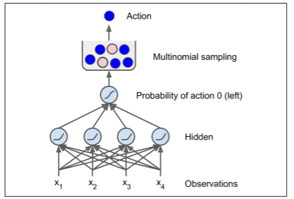
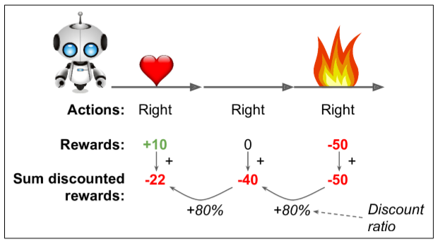

# 第16章 强化学习

强化学习(RL)如今是机器学习的一大令人激动的领域，当然之前也是。自从1950年被发明出来后，它在这些年产生了一些有趣的应用，尤其是在游戏(例如TD-Gammon，一个西洋双陆棋程序)和及其控制领域。，但是从未弄出什么大新闻。直到2013年一个革命性的发展：来自英国的研究者发起了一项Deepmind项目，这个项目可以学习去玩任何从头开始的Atari游戏，甚至多数比人类玩的还要好，它仅适用像素作为输入并且没有游戏规则的任何先验知识。这是一系列令人惊叹的壮举，在2016年3月以他们的系统阿尔法狗战胜了世界围棋冠军李世石。没有一个程序能接近这个游戏的主宰，更不用说世界冠军了。今天，RL的整个领域正在沸腾着新的想法，其都具有广泛的应用范围。DeepMind在2014被谷歌以超过5亿美元收购。

那么他们是怎么做到的呢？事后看来，原理似乎相当简单：他们将深度学习运用到强化学习领域，结果却超越了他们最疯狂的设想。在本章中，我们将首先解释强化学习是什么，以及它擅长于什么，然后我们将介绍两个在深度强化学习领域最重要的技术：策略梯度和深度Q网络（DQN），包括讨论马尔可夫决策过程（MDP）。我们将使用这些技术来训练一个模型来平衡移动车上的杆子，另一个玩Atari游戏。同样的技术可以用于各种各样的任务，从步行机器人到自动驾驶汽车。

## 学习优化奖励

在强化学习中，智能体在环境中观察并且做出决策，随后它会得到奖励。它的目标是去学习如何行动能最大化期望的奖励。如果你不在意去拟人化的话，你可以认为正奖励是愉快，负奖励是痛苦（这样的话奖励一词就有点误导了）。简单来说，智能体在环境中行动，并且在实验和错误中去学习最大化它的愉快，最小化它的痛苦。

这是一个相当广泛的设置，可以适用于各种各样的任务。以下是几个例子（详见图16-1）：

a.智能体可以是控制一个机械狗的程序。在此例中，环境就是真实的世界，智能体通过许多的传感器例如摄像机或者传感器来观察，它可以通过给电机驱动信号来行动。它可以被编程设置为如果到达了目的地就得到正奖励，如果浪费时间，或者走错方向，或摔倒了就得到负奖励。
b.智能体可以是控制MS.Pac-Man的程序。在此例中，环境是Atari游戏的仿真，行为是9个操纵杆位（上下左右中间等等），观察是屏幕，回报就是游戏点数。
c.相似地，智能体也可以是棋盘游戏的程序例如：GO游戏。
d.智能体也可以不用去控制一个实体（或虚拟的）去移动。例如它可以是一个智能程序，当它调整到目标温度以节能时会得到正奖励，当人们需要自己去调节温度时它会得到负奖励，所以智能体必须学会预见人们的需要。
e.智能体也可以去观测股票市场价格以实时决定买卖。奖励的依据显然为挣钱或者赔钱。


其实没有正奖励也是可以的，例如智能体在迷宫内移动，它每分每秒都得到一个负奖励，所以它要尽可能快的找到出口！还有很多适合强化学习的领域，例如自动驾驶汽车，在网页上放广告，或者控制一个图像分类系统让它明白它应该关注于什么。

## 策略搜索

被智能体使用去改变它行为的算法叫做策略。例如，策略可以是一个把观测当输入，行为当做输出的神经网络。


这个策略可以是你能想到的任何算法，它甚至可以不被确定。举个例子，例如，考虑一个真空吸尘器，它的奖励是在30分钟内捡起的灰尘数量。它的策略可以是每秒以概率P向前移动，或者以概率1-P随机地向左或向右旋转。旋转角度将是-R和+R之间的随机角度，因为该策略涉及一些随机性，所以称为随机策略。机器人将有一个不稳定的轨迹，它保证它最终会到达任何可以到达的地方，并捡起所有的灰尘。问题是：30分钟后它会捡起多少灰尘？

你怎么训练这样的机器人？你可以调整两个策略参数：概率P和角度范围R。一个想法是这些参数尝试许多不同的值，并选择执行最佳的组合（见图16-3）。这是一个策略搜索的例子，在这种情况下使用野蛮的方法。然而，当策略空间太大（通常情况下），以这样的方式找到一组好的参数就像在一个巨大的草堆中寻找一根针。

另一种搜寻策略空间的方法是遗传算法。例如你可以随机创造一个包含100个策略的第一代基因，随后杀死80个坏策略，随后让20个幸存策略繁衍4代。一个后代只是它父辈基因的复制品加上一些随机变异。幸存的策略加上他们的后代共同构成了第二代。你可以继续以这种方式迭代代，直到找到一个好的策略。


另一种方法是使用优化技术，通过评估关于策略参数的奖励的梯度，然后通过跟随梯度向更高的奖励（梯度上升）调整这些参数。这种方法被称为策略梯度（PG），我们将在本章后面详细讨论。例如，回到真空吸尘器机器人，你可以稍微增加P并评估这是否增加了机器人在30分钟内拾起的灰尘的量；如果它相对应增加P，或者减少P。我们将使用Tensorflow来实现PG算法，但是在这之前我们需要为智能体创造一个生存的环境，所以现在是介绍OpenAI的时候了。

## OpenAI的介绍

强化学习的一个挑战是，为了训练智能体，首先需要有一个工作环境。如果你想设计一个可以学习Atari游戏的程序，你需要一个Atari游戏模拟器。如果你想设计一个步行机器人，那么环境就是真实的世界，你可以直接在这个环境中训练你的机器人，但是这有其局限性：如果机器人从悬崖上掉下来，你不能仅仅点击“撤消”。你也不能加快时间；增加更多的计算能力不会让机器人移动得更快。一般来说，同时训练1000个机器人是非常昂贵的。简而言之，训练在现实世界中是困难和缓慢的，所以你通常需要一个模拟环境，至少需要引导训练。

OpenAI gym是一个工具包，它提供各种各样的模拟环境（Atari游戏，棋盘游戏，2D和3D物理模拟等等），所以你可以训练，比较，或开发新的RL算法。

让我们安装OpenAI gym。可通过pip安装：

$ pip install --upgrade gym

接下来打开Python shell或Jupyter笔记本创建您的第一个环境：

```python
>>> import gym 
>>> env = gym.make("CartPole-v0") 
[2016-10-14 16:03:23,199] Making new env: MsPacman-v0 
>>> obs = env.reset() 
>>> obs 
array([-0.03799846,-0.03288115,0.02337094,0.00720711]) 
>>> env.render() 
```

使用 *make（）* 函数创建一个环境，在此例中是CartPole环境。这是一个2D模拟，其中推车可以被左右加速，以平衡放置在它上面的平衡杆（见图16-4）。在创建环境之后，我们需要使用 *reset（）* 初始化。这会返回第一个观察结果。观察取决于环境的类型。对于CartPole环境，每个观测是包含四个浮点的1D Numpy向量：这些浮点数代表推车的水平位置（0为中心）、其速度、杆的角度（0维垂直）及其角速度。最后， *render（）* 方法显示如图16-4所示的环境。


如果你想让 *render()* 让图像以一个NUMPY数组格式返回，可以将 *mode* 参数设置为 *rgb_array* （注意其他环境可能支持不同的模式）：

```python
>>> img = env.render(mode="rgb_array") 
>>> img.shape  # height, width, channels (3=RGB) 
(400, 600, 3)
```

不幸的是，即使将 *mode* 参数设置为 *rgb_array* ，CartPole（和其他一些环境）还是会将将图像呈现到屏幕上。避免这种情况的唯一方式是使用一个fake X服务器，如XVFB或XDimMy。例如，可以使用以下命令安装XVFB和启动Python： xvfb-run -s "screen 0 1400x900x24" python。或者使用xvfbwrapper包。

让我们来询问环境什么动作是可能的：

```python
>>> env.action_space 
Discrete(2)
```

*Discrete(2)* 表示可能的动作是整数0和1，表示向左（0）或右（1）的加速。其他环境可能有更多的动作，或者其他类型的动作（例如，连续的）。因为杆子向右倾斜，让我们向右加速推车：

```python
>>> action = 1  # accelerate right 
>>> obs, reward, done, info = env.step(action) 
>>> obs 
array([-0.03865608,  0.16189797,  0.02351508, -0.27801135]) 
>>> reward 
1.0 
>>> done 
False 
>>> info 
{} 
```

*step()* 表示执行给定的动作并返回四个值：

obs:
    这是新的观测，小车现在正在向右走（obs[1]>0）。平衡杆仍然向右倾斜（obs[2]>0），但是他的角速度现在为负（obs[3]<0），所以它在下一步后可能会向左倾斜。

reward：
    在这个环境中，无论你做什么，每一步都会得到1.0奖励，所以游戏的目标就是尽可能长的运行。

done：
    当游戏结束时这个值会为 *True* 。当平衡单倾斜太多时会发生这种情况。之后，必须重新设置环境才能重新使用。

info：
    该字典可以在其他环境中提供额外的调试信息。这些数据不应该用于训练（这是作弊）。

让我们编码一个简单的策略，当杆向左倾斜时加速左边，当杆向右倾斜时加速。我们使用这个策略来获得超过500步的平均回报：

```python
def basic_policy(obs):    
    angle = obs[2]    
    return 0 if angle < 0 else 1
totals = [] 
for episode in range(500):    
    episode_rewards = 0    
    obs = env.reset()    
    for step in range(1000): # 最多1000 步，我们不想让它永远运行下去        
        action = basic_policy(obs)        
        obs, reward, done, info = env.step(action)        
        episode_rewards += reward        
        if done:            
            break    
    totals.append(episode_rewards)
```

这个代码希望能自我解释。让我们看看结果：

```python
>>> import numpy as np 
>>> np.mean(totals), np.std(totals), np.min(totals), np.max(totals) (42.125999999999998, 9.1237121830974033, 24.0, 68.0)
```

即使有500次尝试，这一策略从未超过68个连续的步骤保持平衡杆直立。这不太好。如果你看一下Juyter Notebook中的模拟，你会发现，推车越来越强烈地左右摆动，直到平衡杆倾斜太多。让我们看看神经网络是否能提出更好的策略。

##神经网络策略

让我们创建一个神经网络策略。就像之前我们编码的策略一样，这个神经网络将把观察作为输入，输出要执行的动作。更确切地说，它将估计每个动作的概率，然后我们将根据估计的概率随机地选择一个动作（见图16-5）。在CartPole环境中，只有两种可能的动作（左或右），所以我们只需要一个输出神经元。它将输出动作0（左）的概率p，动作1（右）的概率显然将是1 - p。

例如，如果它输出0.7，那么我们将以70%的概率选择动作0，以30%的概率选择动作1。



你可能奇怪为什么我们根据神经网络给出的概率来选择随机的动作，而不是选择最高分数的动作。这种方法使这个点在探索新的行为和利用已知的工作的行动之间找到正确的平衡。举个例子：假设你第一次去餐馆，所有的菜看起来同样吸引人，所以你随机挑选一个。如果菜好吃，你可以增加下一次点它的概率，但是你不应该把这个概率提高到100%，否则你将永远不会尝试其他菜肴，其中一些甚至比你尝试的更好。

还要注意，在这个特定的环境中，过去的动作和观察可以被安全地忽略，因为每个观察都包含环境的完整状态。如果有一些隐藏状态，那么你也需要考虑过去的行为和观察。例如，如果环境仅仅揭示了推车的位置，而不是它的速度，那么你不仅要考虑当前的观测，还要考虑先前的观测，以便估计当前的速度。另一个例子是当观测是有噪声的的，在这种情况下，通常你想用过去的观察来估计最可能的当前状态。因此，CartPole问题是简单的；观测是无噪声的，而且它们包含环境的全状态。

```python
import tensorflow as tf 
from tensorflow.contrib.layers import fully_connected
# 1. 声明神经网络结构 
n_inputs = 4  # == env.observation_space.shape[0] 
n_hidden = 4  # 这只是个简单的测试，不需要过多的隐藏层
n_outputs = 1 # 只输出向左加速的概率
initializer = tf.contrib.layers.variance_scaling_initializer()
# 2. 建立神经网络 
X = tf.placeholder(tf.float32, shape=[None, n_inputs]) hidden = fully_connected(X, n_hidden, activation_fn=tf.nn.elu,weights_initializer=initializer)                
logits = fully_connected(hidden, n_outputs, activation_fn=None,weights_initializer=initializer)                   
outputs = tf.nn.sigmoid(logits)
# 3. 在概率基础上随机选择动作
p_left_and_right = tf.concat(axis=1, values=[outputs, 1 - outputs]) 
action = tf.multinomial(tf.log(p_left_and_right), num_samples=1)
init = tf.global_variables_initializer() 
```

让我们通读代码：
    1.在导入之后，我们定义了神经网络体系结构。输入的数量是观测空间的大小（在CartPole的情况下是4个），我们只有4个隐藏单元，并且不需要更多，并且我们只有1个输出概率（向左的概率）。

    2.接下来我们构建了神经网络。在这个例子中，它是一个vanilla 多层感知器，只有一个输出。注意，输出层使用Logistic（Sigmoid）激活函数，以便输出从0到1的概率。如果有两个以上的可能动作，每个动作都会有一个输出神经元，你将使用Softmax激活函数。

    3.最后，我们调用 *multinomial()* 函数来选择一个随机动作。该函数独立地采样一个（或多个）整数，给定每个整数的对数概率。例如，如果通过设置num_samples=5，令数组为[np.log（0.5），np.log（0.2），np.log（0.3）]来调用它，那么它将输出五个整数，每个整数都有50%的概率是0, 20%为1，30%为2。在我们的情况下，我们只需要一个整数来表示要采取的行动。由于输出张量仅包含向左的概率，所以我们必须首先将1个输出连接到它，以得到包含左和右动作的概率的张量。请注意，如果有两个以上的可能动作，神经网络将不得不输出每个动作的概率，这样你就不需要连接步骤了。

好了，现在我们有一个可以观察和输出动作的神经网络了，那我们怎么训练它呢？

##评价行为：信用分配问题

如果我们知道每一步的最佳动作，我们可以像通常一样训练神经网络，通过最小化估计概率和目标概率之间的交叉熵。这只是通常的监督学习。然而，在强化学习中，智能体获得的指导的唯一途径是通过奖励，奖励通常是稀疏的和延迟的。例如，如果智能体在100个步骤内设法平衡杆，它怎么知道它采取的100个行动中的哪一个是好的，哪些是坏的？它所知道的是，在最后一次行动之后，杆子坠落了，但最后一次行动肯定不是完全负责的。这被称为信用分配问题：当智能体得到奖励时，很难知道哪些行为应该被信任（或责备）。想想一只狗在行为良好后几小时就会得到奖励，它会明白它得到了什么回报吗？

为了解决这个问题，一个通常的策略是基于这个动作后得分的总和来评估这个个动作，通常在每个步骤中应用衰减率r。例如（见图16-6），如果一个智能点决定连续三次向右，在第一步之后得到+10奖励，第二步后得到0，最后在第三步之后得到-50，然后假设我们使用衰减率r＝0.8，那么第一个动作将得到10 +r×0 + r2×（-50）＝-22的分述。如果衰减率接近0，那么与即时奖励相比，未来的奖励不会有多大意义。相反，如果衰减率接近1，那么对未来的奖励几乎等于即时回报。典型的衰减率通常为是0.95或0.99。如果衰减率为0.95，那么未来13步的奖励大约是即时奖励的一半（0.9513×0.5），而当衰减率为0.99，未来69步的奖励是即时奖励的一半。在CartPole环境下，行为具有相当短期的影响，因此选择0.95的折扣率是合理的。



当然，一个好的动作可能会伴随着一些坏的动作，这些动作会导致平衡杆迅速下降，从而导致一个好的动作得到一个低分数（类似的，一个好演员有时会在一部烂片中扮演主角）。然而，如果我们花足够多的时间来训练游戏，平均下来好的行为会得到比坏的更好的分数。因此，为了获得相当可靠的动作分数，我们必须运行很多次并将所有动作分数归一化（通过减去平均值并除以标准偏差）。之后，我们可以合理地假设消极得分的行为是坏的，而积极得分的行为是好的。现在我们有一个方法来评估每一个动作，我们已经准备好使用策略梯度来训练我们的第一个智能体。让我们看看如何。

##策略梯度

正如前面所讨论的，PG算法通过遵循更高回报的梯度来优化策略参数。一种流行的PG算法，称为增强算法，在1929由Ronald Williams提出。这是一个常见的变体：

    1.首先，让神经网络策略玩几次游戏，并在每一步计算梯度，这使得智能点更可能选择行为，但不应用这些梯度。

    2.运行几次后，计算每个动作的得分（使用前面段落中描述的方法）。

    3.如果一个动作的分数是正的，这意味着动作是好的，可应用较早计算的梯度，以便将来有更大的的概率选择这个动作。但是，如果分数是负的，这意味着动作是坏的，要应用负梯度来使得这个动作在将来采取的可能性更低。我们的方法就是简单地将每个梯度向量乘以相应的动作得分。

    4.最后，计算所有得到的梯度向量的平均值，并使用它来执行梯度下降步骤。

让我们使用TensorFlow实现这个算法。我们将训练我们早先建立的神经网络策略，让它学会平衡车上的平衡杆。让我们从完成之前编码的构造阶段开始，添加目标概率、代价函数和训练操作。因为我们的意愿是选择的动作是最好的动作，如果选择的动作是动作0（左），则目标概率必须为1，如果选择动作1（右）则目标概率为0：

```python
y = 1. - tf.to_float(action) 
```

现在我们有一个目标概率，我们可以定义成本函数（交叉熵）并计算梯度：

```python
learning_rate = 0.01
cross_entropy = tf.nn.sigmoid_cross_entropy_with_logits(                    labels=y, logits=logits) 
optimizer = tf.train.AdamOptimizer(learning_rate) 
grads_and_vars = optimizer.compute_gradients(cross_entropy)
```

注意，我们正在调用优化器的 *compute_gradients()* 方法，而不是 *minimize()* 方法。这是因为我们想要在使用它们之前调整梯度。 *compute_gradients()* 方法返回梯度向量/变量对的列表（每个可训练变量一对）。让我们把所有的梯度放在一个列表中，以便方便地获得它们的值：

```python
gradients = [grad for grad, variable in grads_and_vars] 
```

好，现在是棘手的部分。在执行阶段，算法将运行策略，并在每个步骤中评估这些梯度张量并存储它们的值。在多次运行之后，它如先前所解释的调整这些梯度（即，通过动作分数乘以它们并使它们归一化），并计算调整后的梯度的平均值。接下来，需要将结果梯度反馈到优化器，以便它可以执行优化步骤。这意味着对于每一个梯度向量我们需要一个placeholder。此外，我们必须创建操作去应用更新的梯度。为此，我们将调用优化器的 *apply_gradients()* 函数，该函数采用梯度向量/变量对的列表。我们不给它原始的梯度向量，而是给它一个包含更新梯度的列表（即，通过placeholder递送的梯度）：

```python
gradient_placeholders = [] 
grads_and_vars_feed = [] 
for grad, variable in grads_and_vars:       
    gradient_placeholder = tf.placeholder(tf.float32, shape=grad.get_shape())    
    gradient_placeholders.append(gradient_placeholder)  
    grads_and_vars_feed.append((gradient_placeholder, variable))
training_op = optimizer.apply_gradients(grads_and_vars_feed) 
```

让我们后退一步，看看整个运行过程：

```python
n_inputs = 4 
n_hidden = 4 
n_outputs = 1 
initializer = tf.contrib.layers.variance_scaling_initializer()

learning_rate = 0.01
X = tf.placeholder(tf.float32, shape=[None, n_inputs]) 
hidden = fully_connected(X, n_hidden, activation_fn=tf.nn.elu,weights_initializer=initializer)                          
logits = fully_connected(hidden, n_outputs, activation_fn=None,                    weights_initializer=initializer) 
outputs = tf.nn.sigmoid(logits) 
p_left_and_right = tf.concat(axis=1, values=[outputs, 1 - outputs]) 
action = tf.multinomial(tf.log(p_left_and_right), num_samples=1)

y = 1. - tf.to_float(action) 
cross_entropy = tf.nn.sigmoid_cross_entropy_with_logits(labels=y, logits=logits) 
optimizer = tf.train.AdamOptimizer(learning_rate) 
grads_and_vars = optimizer.compute_gradients(cross_entropy) 
gradients = [grad for grad, variable in grads_and_vars] 
gradient_placeholders = [] 
grads_and_vars_feed = [] 
for grad, variable in grads_and_vars:    
gradient_placeholder = tf.placeholder(tf.float32, shape=grad.get_shape())    gradient_placeholders.append(gradient_placeholder)    
grads_and_vars_feed.append((gradient_placeholder, variable)) 
training_op = optimizer.apply_gradients(grads_and_vars_feed)

init = tf.global_variables_initializer() 
saver = tf.train.Saver()
```

到执行阶段了！我们将需要两个函数来计算总折扣奖励，给予原始奖励，以及归一化多次循环的结果：

```python
def discount_rewards(rewards, discount_rate):    
    discounted_rewards = np.empty(len(rewards))    
    cumulative_rewards = 0    
    for step in reversed(range(len(rewards))):        
        cumulative_rewards = rewards[step] + cumulative_rewards * discount_rate       discounted_rewards[step] = cumulative_rewards    
    return discounted_rewards

def discount_and_normalize_rewards(all_rewards, discount_rate):                           all_discounted_rewards = [discount_rewards(rewards) for rewards in all_rewards]       flat_rewards = np.concatenate(all_discounted_rewards)    
    reward_mean = flat_rewards.mean()    
    reward_std = flat_rewards.std()    
    return [(discounted_rewards - reward_mean)/reward_std  for discounted_rewards in all_discounted_rewards] 
```

让我们检查一下运行的如何：

```python
>>> discount_rewards([10, 0, -50], discount_rate=0.8) 
array([-22., -40., -50.]) 
>>> discount_and_normalize_rewards([[10, 0, -50], [10, 20]], discount_rate=0.8) 
[array([-0.28435071, -0.86597718, -1.18910299]), array([ 1.26665318,  1.0727777 ])] 
```

对 *discount_rewards()* 的调用正好返回我们所期望的（见图16-6）。你也可以验证函数 *iscount_and_normalize_rewards()* 确实返回了两个步骤中每个动作的标准化分数。注意第一步比第二步差很多，所以它的归一化分数都是负的；从第一步开始的所有动作都会被认为是坏的，反之，第二步的所有动作都会被认为是好的。

我们现在有了训练策略所需的一切：

```python
n_iterations = 250      # 训练迭代次数 
n_max_steps = 1000      # 每一次的最大步长 
n_games_per_update = 10 # 每十次训练一次策略 
save_iterations = 10    # 每十次迭代保存模型
discount_rate = 0.95
with tf.Session() as sess:    
    init.run()    
    for iteration in range(n_iterations):        
        all_rewards = []    #每一次的所有奖励        
        all_gradients = []  #每一次的所有梯度        
        for game in range(n_games_per_update):            
            current_rewards = []   #当前步的所有奖励        
            current_gradients = [] #当前步的所有梯度 
            obs = env.reset()            
            for step in range(n_max_steps):                
                action_val, gradients_val = sess.run([action, gradients],
                feed_dict={X: obs.reshape(1, n_inputs)}) # one obs                
                obs, reward, done, info = env.step(action_val[0][0])                current_rewards.append(reward)                
                current_gradients.append(gradients_val)                
                if done:                    
                    break            
                all_rewards.append(current_rewards)            
                all_gradients.append(current_gradients)
        # 此时我们每10次运行一次策略，我们已经准备好使用之前描述的算法去更新策略      
        all_rewards = discount_and_normalize_rewards(all_rewards)        
        feed_dict = {}        
        for var_index, grad_placeholder in enumerate(gradient_placeholders):            # 将梯度与行为分数相乘，并计算平均值
            mean_gradients = np.mean([reward * all_gradients[game_index][step][var_index] for game_index, rewards in enumerate(all_rewards)             for step, reward in enumerate(rewards)],axis=0)            
            feed_dict[grad_placeholder] = mean_gradients        
            sess.run(training_op, feed_dict=feed_dict)  
            if iteration % save_iterations == 0:            
                saver.save(sess, "./my_policy_net_pg.ckpt")
```

每一次训练迭代都是通过运行10次的策略开始的（每次最多1000个步，以避免永远运行）。在每一步，我们也计算梯度，假设选择的行动是最好的。在运行了这10次之后，我们使用 *discount_and_normalize_rewards()* 函数计算动作得分；我们遍历每个可训练变量，在所有次数和所有步骤中，通过其相应的动作分数来乘以每个梯度向量；并且我们计算结果的平均值。最后，我们运行训练操作，给它提供平均梯度（对每个可训练变量提供一个）。我们继续每10个训练次数保存一次模型。

我们做完了！这段代码将训练神经网络策略，它将成功地学会平衡车上的平衡杆（你可以在Juyter notebook上试用）。注意，实际上有两种方法可以让玩家游戏结束：要么平衡可以倾斜太大，要么车完全脱离屏幕。在250次训练迭代中，策略学会平衡极点，但在避免脱离屏幕方面还不够好。额外数百次的训练迭代可以解决这一问题。

研究人员试图找到一种即使当智能点最初对环境一无所知时也能很好地工作的算法。然而，除非你正在写论文，否则你应该尽可能多地将先前的知识注入到智能点中，因为它会极大地加速训练。例如，你可以添加与屏幕中心距离和极点角度成正比的负奖励。此外，如果你已经有一个相当好的策略，你可以训练神经网络模仿它，然后使用策略梯度来改进它。

尽管它相对简单，但是该算法是非常强大的。你可以用它来解决更难的问题，而不仅仅是平衡一辆手推车上的平衡杆。事实上，AlgPaGo是基于类似的PG算法（加上蒙特卡罗树搜索，这超出了本书的范围）。

现在我们来看看另一个流行的算法。与PG算法直接尝试优化策略以增加奖励相反，我们现在看的算法是间接的：智能点学习去估计每个状态的的每个行为未来衰减奖励的期望总和，或者在每个状态的的每个行为未来衰减奖励的期望和。然后，使用这些知识来决定如何行动。为了理解这些算法，我们必须首先介绍马尔可夫决策过程（MDP）。

##马尔可夫决策过程

在二十世纪初，数学家Andrey Markov研究了没有记忆的随机过程，称为马尔可夫链。这样的过程具有固定数量的状态，并且在每个步骤中随机地从一个状态演化到另一个状态。它从状态S演变为状态S的概率是固定的，它只依赖于（S，S’）对，而不是依赖于过去的状态（系统没有记忆）。

图16-7展示了一个具有四个状态的马尔可夫链的例子。假设该过程从状态S0开始，并且在下一步骤中有70%的概率保持在该状态不变中。最终，它必然离开那个状态，并且永远不会回来，因为没有其他状态回到S0。如果它进入状态S1，那么它很可能会进入状态S2（90%的概率），然后立即回到状态S1（以100%的概率）。它可以在这两个状态之间交替多次，但最终它会落入状态S3并永远留在那里（这是一个终端状态）。马尔可夫链可以有非常不同的应用，它们在热力学、化学、统计学等方面有着广泛的应用。


马尔可夫决策过程最初是在20世纪50年代由Richard Bellman描述的。它们类似于马尔可夫链，但有一个连接：在每一步中，一个智能点可以选择几种可能的动作中的一个，并且转移概率取决于所选择的动作。此外，一些状态转换返回一些奖励（正或负），智能点的目标是找到一个策略，随着时间的推移将最大限度地提高奖励。

例如，图16-8中所示的MDP在每个步骤中具有三个状态和三个可能的离散动作。如果从状态S0开始，随着时间的推移可以在动作A0、A1或A2之间进行选择。如果它选择动作A1，它就保持在状态S0中，并且没有任何奖励。因此，如果愿意的话，它可以决定永远呆在那里。但是，如果它选择动作A0，它有70%的概率获得10奖励，并保持在状态S0。然后，它可以一次又一次地尝试获得尽可能多的奖励。但它将在状态S1中结束这样的行为。在状态S1中，它只有两种可能的动作：A0或A1。它可以通过反复选择动作A1来选择停留，或者它可以选择移动到状态S2并得到-50奖励。在状态S3中，除了采取行动A1之外，别无选择，这将最有可能引导它回到状态S0，在途中获得40的奖励。通过观察这个MDP，你能猜出哪一个策略会随着时间的推移而获得最大的回报吗？在状态S0中，清楚地知道A0是最好的选择，在状态S3中，智能点别无选择，只能采取行动A1，但是在状态S1中，智能点否应该保持不动（A0）或通过火（A2），这是不明确的。

Bellman找到了一种估计任何状态S的最佳状态值的方法，他提出了V（s），它是智能点在其达到最佳状态s后所有衰减的总和的平均期望。他表明，如果智能点的行为最佳，那么贝尔曼最优性方程适用（见方程16-1）。这个递归方程表示，如果代理最优地运行，那么当前状态的最优值等于在采取一个最优动作之后平均得到的奖励，加上该动作可能导致的所有可能的下一个状态的期望最优值。


其中：
    T为智能点选择动作a时从状态s到状态s'的概率
    R为智能点选择以动作a从状态s到状态s'的过程中得到的奖励
    y为衰减率

这个等式直接引出了一种算法，该算法可以精确估计每个可能状态的最优状态值：首先将所有状态值估计初始化为零，然后用数值迭代算法迭代更新它们（见方程16-2）。一个显著的结果是，给定足够的时间，这些估计保证收敛到最优状态值，对应于最优策略。


其中：
    V是在k次算法迭代对状态s的估计

该算法是动态规划的一个例子，它将了一个复杂的问题（在这种情况下，估计潜在的未来衰减奖励的总和）变为可处理的子问题，可以迭代地处理（在这种情况下，找到最大化平均报酬与下一个衰减状态值的和的动作）

了解最佳状态值可能是有用的，特别是评估策略，但它没有明确地告诉智能点要做什么。幸运的是，Bellman发现了一种非常类似的算法来估计最优状态动作值，通常称为Q值。状态行动（S，A）对的最优Q值，记为Q（s，a），是智能点在选择动作A到达状态S之后平均期望的衰减的总和，但是是在它看到这个动作的结果之前，假设它在该动作之后起到最佳的作用。

下面是它的工作原理：再次，通过初始化所有的Q值估计为零，然后使用Q值迭代算法更新它们（参见方程16-3）。


一旦你有了最佳的Q值，定义最优的策略π*（s），它是微不足道的：当智能点处于状态S时，它应该选择具有最高Q值的动作，用于该状态。

让我们把这个算法应用到图16-8所示的MDP中。首先，我们需要定义MDP：

```python
nan=np.nan  # 代表不可能的动作 
T = np.array([  # shape=[s, a, s']        
    [[0.7, 0.3, 0.0], [1.0, 0.0, 0.0], [0.8, 0.2, 0.0]],
    [[0.0, 1.0, 0.0], [nan, nan, nan], [0.0, 0.0, 1.0]],       
    [[nan, nan, nan], [0.8, 0.1, 0.1], [nan, nan, nan]],    ]) 
R = np.array([  # shape=[s, a, s']        
    [[10., 0.0, 0.0], [0.0, 0.0, 0.0], [0.0, 0.0, 0.0]],        
    [[10., 0.0, 0.0], [nan, nan, nan], [0.0, 0.0, -50.]],        
    [[nan, nan, nan], [40., 0.0, 0.0], [nan, nan, nan]],    ]) 
possible_actions = [[0, 1, 2], [0, 2], [1]] 
```

让我们运行Q值迭代算法

```python
Q = np.full((3, 3), -np.inf)  # -inf 对应着不可能的动作 
for state, actions in enumerate(possible_actions):    
    Q[state, actions] = 0.0  # 对所有可能的动作初始化为0.0
learning_rate = 0.01 
discount_rate = 0.95 
n_iterations = 100
for iteration in range(n_iterations):   
    Q_prev = Q.copy()    
    for s in range(3):        
        for a in possible_actions[s]:            
            Q[s, a] = np.sum([T[s, a, sp] * (R[s, a, sp] + discount_rate * np.max(Q_prev[sp]))  
            for sp in range(3)]) 
```

结果的Q值类似于如下：

```python
>>> Q 
array([[ 21.89498982,  20.80024033,  16.86353093],       
        [  1.11669335,         -inf,   1.17573546],       
        [        -inf,  53.86946068,         -inf]]) 
>>> np.argmax(Q, axis=1)  # 每一状态的最优动作
array([0, 2, 1]) 
```

这给我们这个MDP的最佳策略，当使用0.95的衰减率时：在状态S0选择动作A0，在状态S1选择动作A2（通过火焰！）在状态S2中选择动作A1（唯一可能的动作）。有趣的是，如果你把衰减率降低到0.9，最优的策略改变：在状态S1中，最好的动作变成A0（保持不变；不通过火）。这是有道理的，因为如果你认为现在比未来更重要，那么未来奖励的前景是不值得立刻经历痛苦的。

##时间差异学习与Q学习

具有离散动作的强化学习问题通常可以被建模为马尔可夫决策过程，但是智能点最初不知道转移概率是什么（它不知道T），并且它不知道奖励会是什么（它不知道R）。它必须经历每一个状态和每一次转变并且至少知道一次奖励，并且如果要对转移概率进行合理的估计，就必须经历多次。

时间差分学习（TD学习）算法与数值迭代算法非常类似，但考虑到智能点仅具有MDP的部分知识。一般来说，我们假设智能点最初只知道可能的状态和动作，没有更多了。智能点使用探索策略，例如，纯粹的随机策略来探索MDP，并且随着它的发展，TD学习算法基于实际观察到的转换和奖励来更新状态值的估计（见方程16-4）。


其中：
    a是学习率（例如0.01）

TD学习与随机梯度下降有许多相似之处，特别是它一次处理一个样本的行为。就像SGD一样，只有当你逐渐降低学习速率时，它才能真正收敛（否则它将在极值点震荡）。

对于每个状态S，该算法只跟踪智能点离开该状态时立即获得的奖励的平均值，再加上它期望稍后得到的奖励（假设它的行为最佳）。

类似地，Q学习算法是Q值迭代算法的自适应版本，其适应过渡概率和回报在初始未知的情况（见方程16-5）。


对于每一个状态动作对（s，a），该算法跟踪智能点在以动作A离开状态S时获得的奖励的运行平均值R，加上它期望稍后得到的奖励。由于目标策略将最优地运行，所以我们取下一状态的Q值估计的最大值。

以下是如何实现Q-学习：

```python
import numpy.random as rnd
learning_rate0 = 0.05 
learning_rate_decay = 0.1 
n_iterations = 20000
s = 0 # 在状态 0开始
Q = np.full((3, 3), -np.inf)  # -inf 对应着不可能的动作 
for state, actions in enumerate(possible_actions):    
    Q[state, actions] = 0.0  # 对于所有可能的动作初始化为 0.0
for iteration in range(n_iterations):    
    a = rnd.choice(possible_actions[s])  # 随机选择动作   
    sp = rnd.choice(range(3), p=T[s, a]) # 使用 T[s, a] 挑选下一状态   
    reward = R[s, a, sp]    
    learning_rate = learning_rate0 / (1 + iteration * learning_rate_decay)    
    Q[s, a] = learning_rate * Q[s, a] + (1 - learning_rate) * (reward + discount_rate * np.max(Q[sp]))    
    s = sp # 移动至下一状态
```

给定足够的迭代，该算法将收敛到最优Q值。这被称为关闭策略算法，因为正在训练的策略不是正在执行的策略。令人惊讶的是，该算法能够通过观察智能点行为随机学习（例如学习当你的老师是一个醉猴子时打高尔夫球）最佳策略。我们能做得更好吗？

##探索策略

当然，只有在探索策略充分探索MDP的情况下，Q-学习才能起作用。尽管一个纯粹的随机策略保证最终访问每一个状态和每个转换多次，但可能需要很长的时间这样做。因此，一个更好的选择是使用ε-贪婪策略：在每个步骤中，它以概率ε随机地或以概率为1-ε贪婪地（选择具有最高Q值的动作）。ε-贪婪策略的优点（与完全随机策略相比）是，它将花费越来越多的时间来探索环境中有趣的部分，因为Q值估计越来越好，同时仍花费一些时间访问MDP的未知区域。以ε为很高的值（例如，1）开始，然后逐渐减小它（例如，下降到0.05）是很常见的。

可选择的，相比于依赖于探索的机会，另一种方法是鼓励探索政策来尝试它以前没有尝试过的行动。这可以被实现为附加于Q值估计的奖金，如方程16-6所示。


其中：
    N计算了在状态s时选择动作a的次数
    f是一个探索函数，例如f=q+K/（1+n），其中K是一个好奇超参数，它测量智能点被吸引到未知者的程度。

##近似Q学习

Q-学习的主要问题是，它不能很好地扩展到具有许多状态和动作的大（甚至中等）的MDP。试着用Q-学习来训练一个智能点去玩 Ms. Pac-Man。 Ms. Pac-Man可以吃超过250粒粒子，每一粒都可以存在或不存在（即已经吃过）。因此，可能状态的数目大于2的250次幂，约等于10的75次幂（并且这是考虑颗粒的可能状态）。这比在可观测的宇宙中的原子要多得多，所以你绝对无法追踪每一个Q值的估计值。

解决方案是找到一个函数，使用可管理数量的参数来近似Q值。这被称为近似Q学习。多年来，人们都是手工在状态中提取并线性组合特征（例如，最近的鬼的距离，它们的方向等）来估计Q值，但是DeepMind表明使用深度神经网络可以工作得更好，特别是对于复杂的问题。它不需要任何特征工程。用于估计Q值的DNN被称为深度Q网络（DQN），并且使用近似Q学习的DQN被称为深度Q学习。

在本章的剩余部分，我们将使用深度Q学习来训练一个智能点去玩 Ms. Pac-Man，就像DeepMind在2013所做的那样。代码可以很容易地调整，调整后学习去玩大多数Atari游戏的效果都相当好。在大多数动作游戏中，它可以达到超人的技能，但它在长卷游戏中却不太好。

##学习去使用深度Q学习来玩Ms. Pac-Man


```python
>>> import gym 
>>> env = gym.make("CartPole-v0") 
[2016-10-14 16:03:23,199] Making new env: MsPacman-v0 
>>> obs = env.reset() 
>>> obs array([-0.03799846,-0.03288115,0.02337094,0.00720711]) 
>>> env.render() 
```
##感谢

在我们结束这本书的最后一章之前，我想感谢你们读到最后一段。我真心希望你能像我写这本书一样愉快地阅读这本书，这对你的项目，或多或少都是有用的。

如果发现错误，请发送反馈。更一般地说，我很想知道你的想法，所以请不要犹豫，通过 O’Reilly来与我联系，或者通过 ageron/ handson-ml  GITHUB项目来练习。

对你来说，我最好的建议是练习和练习：如果你还没有做过这些练习，试着使用Juyter notebook参加所有的练习，加入kaggle网站或其他ML社区，看ML课程，阅读论文，参加会议，会见专家。您可能还想研究我们在本书中没有涉及的一些主题，包括推荐系统、聚类算法、异常检测算法和遗传算法。

我最大的希望是，这本书将激励你建立一个美妙的ML应用程序，这将有利于我们所有人！那会是什么呢？

2016年11月26日，奥列伦·格伦