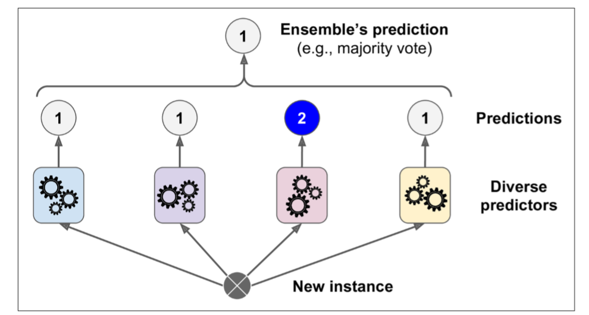
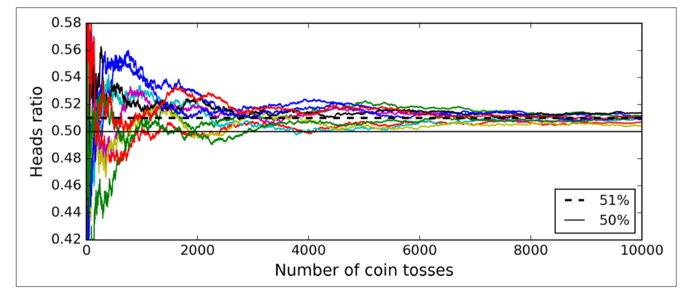
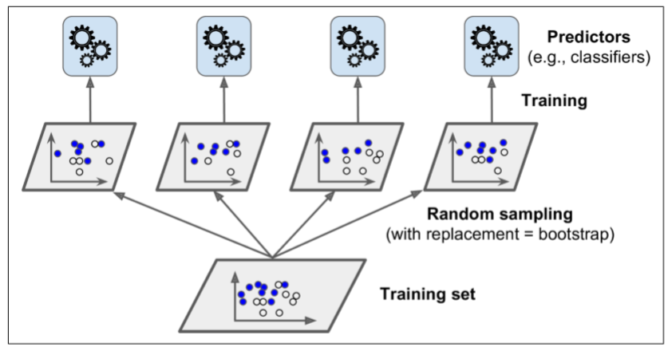
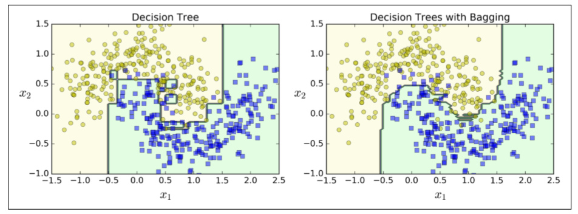
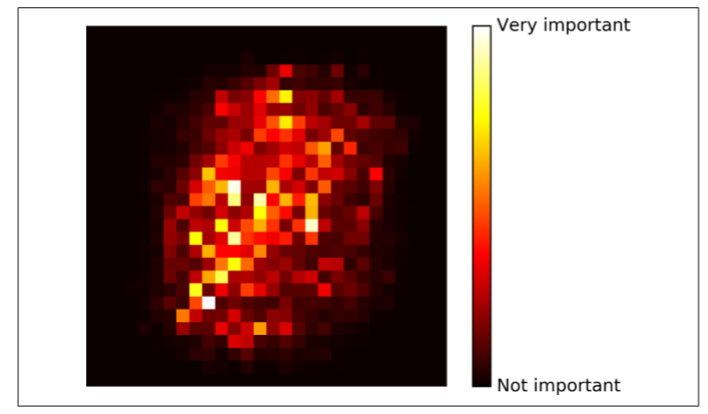
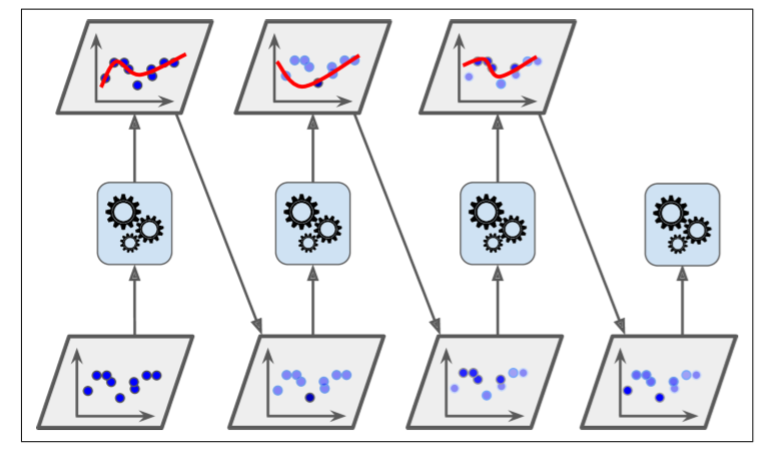
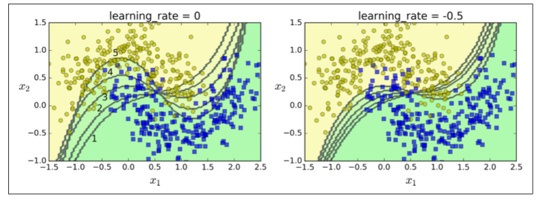
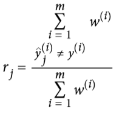

# 第7章 集成学习与随机森林

假设你去随机问很多人一个很复杂的问题，然后把它们的答案合并起来。通常情况下你会发现这个合并的答案比一个专家的答案要好。这就叫做 *群体智慧* 。同样的，如果你合并了一组分类器的预测（像分类或者回归），你也会得到一个比单一分类器更好的预测结果。这一组分类器就叫做集成；因此，这个技术就叫做集成学习，一个集成学习算法就叫做集成方法。

例如，你可以训练一组决策树分类器，每一个都在一个随机的训练集上。为了去做预测，你必须得到所有单一树的预测值，然后通过投票（例如第六章的练习）来预测类别。例如一种决策树的集成就叫做随机森林，它除了简单之外也是现今存在的最强大的机器学习算法之一。

向我们在第二章讨论的一样，我们会在一个项目快结束的时候使用集成算法，一旦你建立了一些好的分类器，就把他们合并为一个更好的分类器。事实上，在机器学习竞赛中获得胜利的算法经常会包含一些集成方法。

在本章中我们会讨论一下特别著名的集成方法，包括 *bagging, boosting, stacking* ，和其他一些算法。我们也会讨论随机森林。

## 投票分类

假设你已经训练了一些分类器，每一个都有80%的准确率。你可能有了一个逻辑斯蒂回归、或一个SVM、或一个随机森林，或者一个KNN，或许还有更多（详见图7-1）


一个非常简单去创建一个更好的分类器的方法就是去整合每一个分类器的预测然后经过投票去预测分类。这种分类器就叫做硬投票分类器（详见图7-2）。



令人惊奇的是这种投票分类器得出的结果经常会比集成中最好的一个分类器结果更好。事实上，即使每一个分类器都是一个弱学习器（意味着它们也就比瞎猜好点），集成后仍然是一个强学习器（高准确率），只要有足够数量的弱学习者，他们就足够多样化。

这怎么可能？接下来的分析将帮助你解决这个疑问。假设你有一个有偏差的硬币，他有51%的几率正面朝上，49%的几率背面朝上。如果你实验1000次，你会得到差不多510次正面朝上，490次背面朝上，因此大多数人都是正面的。如果你用数学计算，你会发现在实验1000次后得到满足正面朝上的概率51%的人比例为是75%。你实验的次数越多，正面朝上的几率越大（例如你试验了10000次，人群比例可能性就会达到97%）。这是因为 *大数定律* ：当你一直用硬币实验时，正面朝上的比率会越来越接近51%。图7-3展示了始终有偏差的硬币实验。你可以看到当实验次数上升时，正面朝上的概率接近于51%。最终所有10种实验都会收敛到51%，它们都大于50%。



同样的，假设你创建了一个包含1000个分类器的集成模型，其中每个分类器的正确率只有51%（仅比瞎猜好一点点）。如果你用投票去预测类别，你可能得到75%的准确率！然而，这仅仅在所有的分类器都独立运行的很好、不会发生有相关性的错误的情况下才会这样，然而每一个分类器都在同一个数据集上训练，导致其很可能会发生这样的错误。他们可能会犯同一种错误，所以也会有很多票投给了错误类别导致集成的准确率下降。

如果使每一个分类器都独立自主的分类，那么集成模型会工作的很好。去得到多样的分类器的方法之一就是用完全不同的算法，这会使它们会做出不同种类的错误，这会提高集成的正确率

接下来的代码创建和训练了在sklearn中的投票分类器。这个分类器由三个不同的分类器组成（训练集是第五章中的moons数据集）：

```python
>>> from sklearn.ensemble import RandomForestClassifier 
>>> from sklearn.ensemble import VotingClassifier 
>>> from sklearn.linear_model import LogisticRegression 
>>> from sklearn.svm import SVC
>>> log_clf = LogisticRegression() 
>>> rnd_clf = RandomForestClassifier() 
>>> svm_clf = SVC()
>>> voting_clf = VotingClassifier(estimators=[('lr', log_clf), ('rf', rnd_clf), >>> ('svc', svm_clf)],voting='hard') 
>>> voting_clf.fit(X_train, y_train)
```

让我们看一下在测试集上的准确率：

```python
>>> from sklearn.metrics import accuracy_score 
>>> for clf in (log_clf, rnd_clf, svm_clf, voting_clf): 
>>>     clf.fit(X_train, y_train) 
>>>     y_pred = clf.predict(X_test) 
>>>     print(clf.__class__.__name__, accuracy_score(y_test, y_pred)) 
LogisticRegression 0.864 
RandomForestClassifier 0.872 
SVC 0.888 
VotingClassifier 0.896 
```
你看！投票分类器比其他单独的分类器表现的都要好。

如果所有的分类器都能够预测类别的概率（例如他们有一个 *predict_proba()* 方法），那么你就可以让sklearn以最高的类概率来预测这个类，平均在所有的分类器上。这种方式叫做软投票。他经常比硬投票表现的更好，因为它给予高自信的投票更大的权重。你可以通过把 *voting="hard"* 设置为 *voting="soft"* 来保证分类器可以预测类别概率。然而这不是SVC类的分类器默认的选项，所以你需要把它的 *probability hyperparameter* 设置为 *True* （这会使SVC使用交叉验证去预测类别概率，其降低了训练速度，但会添加 *predict_proba()* 方法）。如果你修改了之前的代码去使用软投票，你会发现投票分类器正确率高达91%

## Bagging 和 Pasting 

换句话说，Bagging 和 Pasting 都允许在多个分类器间对训练集进行多次采样，但只有Bagging
就像之前降到的，可以通过使用不同的训练算法去得到一些不同的分类器。另一种方法就是对每一个分类器都使用相同的训练算法，但是在不同的训练集上去训练它们。有放回采样被称为*Bagging* （是 *bootstrap aggregating* 的缩写）。无放回采样称为粘贴 *pasting* 。
换句话说，Bagging 和 Pasting 都允许在多个分类器上对训练集进行多次采样，但只有Bagging允许对同一种分类器上对训练集进行进行多次采样。采样和训练过程如图7-4所示。



当所有的分类器被训练后，集成可以通过对所有分类器结果的简单聚合来对新的实例进行预测。聚合函数通常对分类是 *统计模式* （例如硬投票分类器）或者对回归是平均。每一个单独的分类器在如果在原始训练集上都是高偏差，但是聚合降低了偏差和方差。通常情况下，集成的结果是有一个相似的偏差，但是对比与在原始训练集上的单一分类器来讲有更小的方差。

正如你在图7-4上所看到的，分类器可以通过不同的CPU核或其他的服务器一起被训练。相似的，分类器也可以一起被制作。这就是为什么Bagging 和 Pasting是如此流行的原因之一：它们的规模很好

## 在sklearn中的Bagging 和 Pasting 

sklearn为Bagging 和 Pasting 提供了一个简单的API： *BaggingClassifier* 类（或者对于回归可以是 *BaggingRegressor* 。接下来的代码训练了一个500个决策树分类器的集成，每一个都是在数据集上有放回采样100个训练实例下进行训练（这是Bagging的例子，如果你想尝试Pasting，就设置  *bootstrap=False* ）。 *n_jobs* 参数告诉sklearn用于训练和预测所需要CPU核的数量。（-1代表着sklearn会使用所有空闲核）：

```python
>>>from sklearn.ensemble import BaggingClassifier 
>>>from sklearn.tree import DecisionTreeClassifier
>>>bag_clf = BaggingClassifier(DecisionTreeClassifier(), n_estimators=500,        >>>max_samples=100, bootstrap=True, n_jobs=-1) 
>>>bag_clf.fit(X_train, y_train) 
>>>y_pred = bag_clf.predict(X_test)
```
如果基分类器可以预测类别概率（例如它拥有 *predict_proba()* 方法），那么 *BaggingClassifier* 会自动的运行软投票，这是决策树分类器的情况。

图7-5对比了单一决策树的决策边界和Bagging集成500个树的决策边界，两者都在moons数据集上训练。正如你所看到的，集成的分类比起单一决策树的分类产生情况更好：集成有一个可比较的偏差但是有一个较小的方差（它在训练集上的错误数目大致相同，但决策边界较不规则）。



Bootstrap在每个预测器被训练的子集中引入了更多的分集，所以Bagging结束时的偏差比Pasting更高，但这也意味着预测因子最终变得不相关，从而减少了集合的方差。总体而言，Bagging通常会导致更好的模型，这就解释了为什么它通常是首选的。然而，如果你有空闲时间和CPU功率，可以使用交叉验证来评估Bagging和Pasting哪一个更好。

## Out-of-Bag评价 

对于Bagging来说，一些实例可能被一些分类器重复采样，但其他的有可能不会被采样。 *BaggingClassifier* 默认采样。 *BaggingClassifier* 默认是有放回的采样 *m* 个实例 （ *bootstrap=True* ），其中 *m* 是训练集的大小，这意味着平均下来只有63%的训练实例被每个分类器采样，剩下的37%个没有被采样的训练实例就叫做 *Out-of-Bag* 实例。注意对于每一个的分类器它们的37%不是相同的。

因为在训练中分类器从开没有看到过oob实例，所以它可以在这些实例上进行评估，而不需要单独的验证集或交叉验证。你可以拿出每一个分类器的 oob来评估集成本身。

在sklearn中，你可以在训练后需要创建一个*BaggingClassifier* 来自动评估时设置 *oob_score=True* 来自动评估。接下来的代码展示了这个操作。评估结果通过变量 *oob_score_* 来显示：

```python
>>> bag_clf = BaggingClassifier(DecisionTreeClassifier(), n_estimators=500,bootstrap=True, n_jobs=-1, oob_score=True)
>>> bag_clf.fit(X_train, y_train) 
>>> bag_clf.oob_score_ 
0.93066666666666664 
```

根据这个 obb评估， *BaggingClassifier* 可以再测试集上达到93.1%的准确率，让我们修改一下：

```python
>>> from sklearn.metrics import accuracy_score 
>>>y_pred = bag_clf.predict(X_test) 
>>> accuracy_score(y_test, y_pred) 
0.93600000000000005 
```

我们在测试集上得到了93.6%的准确率，足够接近了！

对于每个训练实例oob决策函数也可通过 *oob_decision_function_*  变量来展示。在这种情况下（当基决策器有 *pre dict_proba()* 时）决策函数会对每个训练实例返回类别概率。例如，oob评估预测第二个训练实例有60.6%的概率属于正类（39.4%属于负类）：

```python
>>> bag_clf.oob_decision_function_ 
array([[ 0.,  1.], [ 0.60588235,  0.39411765],[ 1., 0. ], 
...  [ 1. ,  0. ],[ 0.,  1.],[ 0.48958333,  0.51041667]]) 
```

## 随机贴片与随机子空间

*BaggingClassifier* 也支持采样特征。它被两个超参数 *max_features* 和 *bootstrap_features* 控制。他们的工作方式和 *max_samples* 和*bootstrap* 一样，但这是对于特征采样而不是实例采样。因此，每一个分类器都会被在随机的输入特征内进行训练。

当你在处理高维度输入下（例如图片）此方法尤其有效。对训练实例和特征的采样被叫做随机贴片。保留了所有的训练实例（例如 *bootstrap=False* 和 *max_samples=1.0* ），但是对特征采样（ *bootstrap_features=True* 并且/或者 *max_features* 小于1.0）叫做随机子空间。

采样特征导致更多的预测多样性，用高偏差换低方差。

## 随机森林

正如我们所讨论的，随机森林是决策树的一种集成，通常是通过bagging 方法（有时是pasting方法）进行训练，通常用 *max_samples* 设置为训练集的大小。与建立一个 *BaggingClassifier* 然后把它放入 *DecisionTreeClassifier* 相反，你可以使用更方便的也是对决策树优化够的 *RandomForestClassifier* （对于回归是 *RandomForestRegressor* ）。接下来的代码训练了带有500个树（每个被限制为16叶子结点）的决策森林，使用所有空闲的CPU核：

```python
>>>from sklearn.ensemble import RandomForestClassifier
>>>rnd_clf = RandomForestClassifier(n_estimators=500, max_leaf_nodes=16, n_jobs=-1) 
>>>rnd_clf.fit(X_train, y_train)
>>>y_pred_rf = rnd_clf.predict(X_test)
```

除了一些例外， *RandomForestClassifier* 使用 *DecisionTreeClassifier* 的所有超参数（决定数怎么生长），把 *BaggingClassifier* 的超参数加起来来控制集成本身。

随机森林算法在树生长时引入了额外的随机；与在节点分裂时需要找到最好分裂特征相反（详见第六章），它在一个随机的特征集中找最好的特征。它导致了树的差异性，并且再一次用高偏差换低方差，总的来说是一个更好的模型。以下是 *BaggingClassifier* 大致相当于之前的 *randomforestclassifier* ：

```python
>>>bag_clf = BaggingClassifier(DecisionTreeClassifier(splitter="random", max_leaf_nodes=16),n_estimators=500, max_samples=1.0, bootstrap=True, n_jobs=-1)
```

## 极端随机树

当你在随机森林上生长树时，在每个结点分裂时只考虑随机特征集上的特征（正如之前讨论过的一样）。相比于找到更好的特征我们可以通过使用对特征使用随机阈值使树更加随机（像规则决策树一样）。

这种极端随机的树被简称为 *Extremely Randomized Trees* （极端随机树），或者更简单的称为 *Extra-Trees* 。再一次用高偏差换低方差。它还使得 *Extra-Trees* 比规则的随机森林更快地训练，因为在每个节点上找到每个特征的最佳阈值是生长树最耗时的任务之一。

你可以使用sklearn的 *ExtraTreesClassifier* 来创建一个 *Extra-Trees* 分类器。他的API跟 *RandomForestClassifier* 是相同的，相似的， *ExtraTreesRegressor* 跟 *RandomForestRegressor* 也是相同的API。

我们很难去分辨 *ExtraTreesClassifier* 和 *RandomForestClassifier* 到底哪个更好。通常情况下是通过交叉验证来比较它们（使用网格搜索调整超参数）。

## 特征重要度

最后，如果你观察一个单一决策树，重要的特征会出现在更靠近根部的位置，而不重要的特征会经常出现在靠近叶子的位置。因此我们可以通过计算一个特征在森林的全部树中出现的平均深度来预测特征的重要性。sklearn在训练后会自动计算每个特征的重要度。你可以通过 *feature_importances_* 变量来查看结果。例如如下代码在iris数据集（第四章介绍）上训练了一个 *RandomForestClassifier* 模型，然后输出了每个特征的重要性。看来，最重要的特征是花瓣长度（44%）和宽度（42%），而萼片长度和宽度相对比较是不重要的（分别为11%和2%）：

```python
>>> from sklearn.datasets import load_iris 
>>> iris = load_iris() 
>>> rnd_clf = RandomForestClassifier(n_estimators=500, n_jobs=-1) 
>>> rnd_clf.fit(iris["data"], iris["target"]) 
>>> for name, score in zip(iris["feature_names"], rnd_clf.feature_importances_): 
>>>     print(name, score) 
sepal length (cm) 0.112492250999
sepal width (cm) 0.0231192882825 
petal length (cm) 0.441030464364 
petal width (cm) 0.423357996355 
```

相似的，如果你在MNIST数据及上训练随机森林分类器（在第三章上介绍），然后画出每个像素的重要性，你可以得到图7-6的图片。



随机森林可以非常方便快速得了解哪些特征实际上是重要的，特别是你需要进行特征选择的时候。

## 提升

提升Boosting（最初称为 *假设增强* ）指的是可以将几个弱学习者组合成强学习者的集成方法。对于大多数的提升方法的思想就是按顺序去训练分类器，每一个都要尝试修正前面的分类。现如今已经有很多的提升方法了，但最著名的就是 *Adaboost* （是 *Adaptive Boosting* 的简称） 和 *Gradient Boosting* 。让我们先从 *Adaboost* 说起。

## Adaboost

使一个新的分类器去修正之前分类结果的方法就是对之前分类结果不对的训练实例多加关注。这导致新的预测因子越来越多地聚焦于这种情况。这是 *Adaboost* 使用的技术。

举个例子，去构建一个Adaboost分类器，第一个基分类器（例如一个决策树）被训练然后在训练集上做预测，在误分类训练实例上的权重就增加了。第二个分类机使用更新过的权重然后再一次训练，权重更新，以此类推（详见图7-7）



图7-8显示连续五次预测的moons数据集的决策边界（在本例中，每一个分类器都是高度正则化带有RBF核的SVM）。第一个分类器误分类了很多实例，所以它们的权重被提升了。第二个分类器因此对这些误分类的实例分类效果更好，以此类推。右边的图代表了除了学习率减半外（误分类实例权重每次迭代上升一半）相同的预测序列。你可以看出，序列学习技术与梯度下降很相似，除了调整单个预测因子的参数以最小化代价函数之外，AdaBoost增加了集合的预测器，逐渐使其更好。



一旦所有的分类器都被训练后，除了分类器根据整个训练集上的准确率被赋予的权重外，集成预测就非常像Bagging和Pasting了。

序列学习技术的一个重要的缺点就是：它不能被并行化（只能按步骤），因为每个分类器只能在之前的分类器已经被训练和评价后再进行训练。因此，它不像Bagging和Pasting一样。

让我们详细看一下Adaboost算法。每一个实例的权重 :math:`w^{i}` 初始都被设为 $\frac{1}{m}$ 第一个分类器被训练，然后他的权重误差率 $r_{1}$ 在训练集上算出，详见公式7-1.

公式7-1：第 $j^{th}$ 个分类器的权重误差率



其中 $\widetilde{y_{j}}^{i}$ 是第 $j^{th}$ 个分类器对于第 $i^{th}$ 实例的预测。


:math:`w_i`


```python
>>>from sklearn.ensemble import BaggingClassifier 
>>>from sklearn.tree import DecisionTreeClassifier
>>>bag_clf = BaggingClassifier(DecisionTreeClassifier(), n_estimators=500,        >>>max_samples=100, bootstrap=True, n_jobs=-1) 
>>>bag_clf.fit(X_train, y_train) 
>>>y_pred = bag_clf.predict(X_test)
```


